

  

<h1 align="center">Performance Ticket Trading System</h1>

## Info

- Student No: 22412088
- Name: 윤정은
- E-mail: wjdsl59@yu.ac.kr

## Revision History

| Revision date | Version | Description | Author |
|---|---|---|---|
| 2026-05-08 | 1.0 | Analysis phase final version | 윤정은 |

# Contents

1. [Introduction](#1-introduction)
2. [Use case analysis](#2-use-case-analysis)
3. [Domain analysis](#3-domain-analysis)
4. [User Interface prototype](#4-user-interface-prototype)
5. [Glossary](#5-glossary)
6. [References](#6-references)

## 1. Introduction

본 문서는 Conceptualization 단계의 문서에 이어지는 Analysis 단계의 문서이다.  
Conceptualization 단계에서 제안한 Performance Ticket Trading System의 주요 기능을 바탕으로, 본 문서에서는 Use case analysis, Domain analysis, User Interface prototype, Glossary를 정리한다.

### 1.1 Summary

최근 콘서트, 뮤지컬, 연극과 같은 공연 산업이 활성화되면서 공연 티켓에 대한 수요가 증가하고 있다. 공연 티켓은 특정 날짜와 시간에 맞추어 사용해야 하므로, 개인 사정으로 관람이 어려워진 사용자가 티켓을 양도하거나 교환하려는 경우가 자주 발생한다.

기존의 중고 거래 플랫폼이나 개인 간 거래 방식은 공연 티켓 거래에 최적화되어 있지 않아 거래 상대방의 신뢰성을 확인하기 어렵고, 공연명, 날짜, 좌석, 가격 등의 정보를 체계적으로 관리하기 어렵다.

따라서 본 문서에서는 사용자 간 공연 티켓 거래를 보다 안전하고 편리하게 지원하기 위한 Performance Ticket Trading System을 제안한다. 이 시스템은 티켓 등록, 검색, 거래 요청, 거래 상태 확인, 신고 기능을 제공함으로써 사용자가 원하는 공연 티켓을 보다 쉽게 찾고, 거래 과정을 명확하게 확인할 수 있도록 한다.

### 1.2 Business Goals

- 사용자가 보유한 공연 티켓을 쉽게 등록할 수 있어야 한다.
- 공연명, 날짜, 좌석, 가격 등을 기준으로 티켓 검색 기능을 제공해야 한다.
- 사용자가 원하는 티켓에 대해 거래 요청을 보낼 수 있어야 한다.
- 거래 요청, 수락, 완료 등의 거래 상태를 명확하게 확인할 수 있어야 한다.
- 신고 기능을 통해 부적절한 티켓 게시글이나 의심스러운 사용자를 신고할 수 있어야 한다.
- 사용자가 공연 티켓 거래 과정을 보다 안전하고 편리하게 이용할 수 있어야 한다.

### 1.3 Technical Goals

- 사용자 계정 정보를 안전하게 저장하고 로그인 인증을 처리할 수 있어야 한다.
- 공연명, 날짜, 시간, 좌석, 가격 등의 티켓 정보를 정확하게 저장할 수 있어야 한다.
- 사용자의 검색 조건에 따라 티켓 목록을 빠르게 조회할 수 있어야 한다.
- 거래 요청, 수락, 완료 등의 상태 변화를 정확하게 관리할 수 있어야 한다.
- 신고 대상, 신고 사유, 상세 내용 등의 신고 정보를 저장할 수 있어야 한다.
- 시스템의 UX/UI는 사용자가 쉽게 이해하고 사용할 수 있도록 구성되어야 한다.
- 시스템의 반응 속도는 사용자에게 불편함을 주지 않도록 적절하게 유지되어야 한다.

## 2. Use case analysis

### 2.1 Use Case Diagram

그림 2-1은 Use Case List를 바탕으로 작성한 Use Case Diagram이다.

  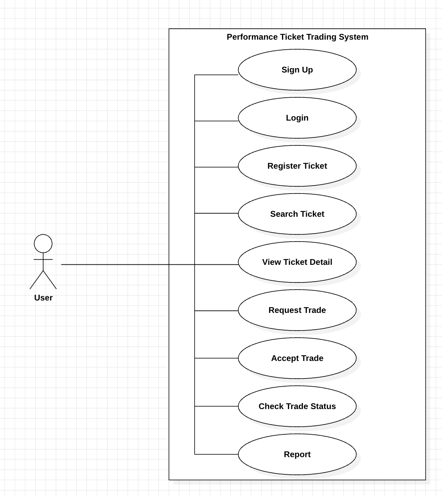

[Figure 2-1] Use Case Diagram

제안된 시스템은 공연 티켓을 등록하고 거래하는 일반 사용자를 대상으로 하기 때문에 Actor는 User 한 명이다.

- Sign Up: 회원가입
- Login: 로그인
- Register Ticket: 티켓 등록
- Search Ticket: 티켓 검색
- View Ticket Detail: 티켓 상세 조회
- Request Trade: 거래 요청
- Accept Trade: 거래 수락
- Check Trade Status: 거래 상태 확인
- Report: 신고

### 2.2 Use Case Description

#### Use case #1 : Sign Up

##### GENERAL CHARACTERISTICS

| Item | Description |
|---|---|
| Summary | 사용자는 시스템을 이용하기 위해 계정을 생성한다. |
| Scope | PTTS (Performance Ticket Trading System) |
| Level | User Level |
| Author | User |
| Last Update | 2026.05.08. |
| Status | Analysis |
| Primary Actor | User |
| Preconditions | 사용자는 시스템에 접속한 상태여야 한다. |
| Trigger | 사용자가 “Sign Up” 버튼을 클릭했을 때 |
| Success Post Condition | 사용자 계정 정보가 데이터베이스에 저장되고, 사용자는 로그인할 수 있는 상태가 된다. |
| Failed Post Condition | 계정 생성에 실패하고, 사용자는 입력 정보를 다시 확인해야 한다. |

##### MAIN SUCCESS SCENARIO

| Step | Action |
|---|---|
| 1 | 사용자가 시스템의 회원가입 화면으로 이동한다. |
| 2 | 사용자가 이름, 이메일, ID, 비밀번호를 입력한다. |
| 3 | 사용자가 “Sign Up” 버튼을 클릭한다. |
| 4 | 시스템은 입력된 정보의 형식과 중복 여부를 확인한다. |
| 5 | 시스템은 사용자 정보를 데이터베이스에 저장한다. |
| 6 | 시스템은 회원가입 완료 메시지를 보여준다. |

##### EXTENSION SCENARIOS

| Step | Branching Action |
|---|---|
| 4a | 사용자가 필수 정보를 입력하지 않은 경우, 시스템은 필수 정보가 누락되었다는 메시지를 보여주고 사용자를 회원가입 정보 입력 단계로 되돌린다. |
| 4b | 사용자가 이미 등록된 이메일 또는 ID를 입력한 경우, 시스템은 이미 사용 중인 정보라는 메시지를 보여주고 사용자를 회원가입 정보 입력 단계로 되돌린다. |
| 4c | 비밀번호 형식이 올바르지 않은 경우, 시스템은 비밀번호 양식이 올바르지 않다는 메시지를 보여주고 사용자를 회원가입 정보 입력 단계로 되돌린다. |

##### RELATED INFORMATION

| Item | Description |
|---|---|
| Performance | ≤ 1 Seconds |
| Due Date |  |

#### Use case #2 : Login

##### GENERAL CHARACTERISTICS

| Item | Description |
|---|---|
| Summary | 사용자는 등록된 계정 정보를 입력하여 시스템에 로그인한다. |
| Scope | PTTS (Performance Ticket Trading System) |
| Level | User Level |
| Author | User |
| Last Update | 2026.05.08. |
| Status | Analysis |
| Primary Actor | User |
| Preconditions | 사용자의 계정 정보가 시스템에 등록되어 있어야 한다. |
| Trigger | 사용자가 “Login” 버튼을 클릭했을 때 |
| Success Post Condition | 사용자는 인증된 상태가 되며, 시스템의 주요 기능을 이용할 수 있다. |
| Failed Post Condition | 로그인에 실패하면, 사용자는 계정 정보를 다시 입력해야 한다. |

##### MAIN SUCCESS SCENARIO

| Step | Action |
|---|---|
| 1 | 사용자가 로그인 화면으로 이동한다. |
| 2 | 사용자가 ID와 비밀번호를 입력한다. |
| 3 | 사용자가 “Login” 버튼을 클릭한다. |
| 4 | 시스템은 입력된 계정 정보를 데이터베이스의 사용자 정보와 비교한다. |
| 5 | 시스템은 계정 정보가 일치하는 경우 로그인을 허용한다. |
| 6 | 시스템은 사용자가 티켓 등록, 티켓 검색, 거래 요청, 거래 상태 확인 등의 주요 기능을 이용할 수 있도록 한다. |

##### EXTENSION SCENARIOS

| Step | Branching Action |
|---|---|
| 4a | 사용자가 ID 또는 비밀번호를 입력하지 않은 경우, 시스템은 필수 정보가 누락되었다는 메시지를 보여주고 로그인 정보 입력 단계로 되돌린다. |
| 4b | 입력한 ID가 존재하지 않는 경우, 시스템은 등록되지 않은 계정이라는 메시지를 보여주고 로그인 정보 입력 단계로 되돌린다. |
| 4c | 비밀번호가 일치하지 않는 경우, 시스템은 비밀번호가 올바르지 않다는 메시지를 보여주고 로그인 정보 입력 단계로 되돌린다. |

##### RELATED INFORMATION

| Item | Description |
|---|---|
| Performance | ≤ 1 Seconds |
| Due Date |  |

#### Use case #3 : Register Ticket

##### GENERAL CHARACTERISTICS

| Item | Description |
|---|---|
| Summary | 사용자는 자신이 보유한 공연 티켓 정보를 시스템에 등록한다. |
| Scope | PTTS (Performance Ticket Trading System) |
| Level | User Level |
| Author | User |
| Last Update | 2026.05.08. |
| Status | Analysis |
| Primary Actor | User |
| Preconditions | 사용자는 로그인 상태여야 한다. |
| Trigger | 사용자가 “Register Ticket” 버튼을 클릭했을 때 |
| Success Post Condition | 입력한 티켓 정보가 데이터베이스에 저장되고, 다른 사용자가 검색할 수 있는 상태가 된다. |
| Failed Post Condition | 티켓 등록에 실패하고, 사용자는 입력 정보를 다시 확인해야 한다. |

##### MAIN SUCCESS SCENARIO

| Step | Action |
|---|---|
| 1 | 사용자가 로그인한다. |
| 2 | 사용자가 티켓 등록 화면으로 이동한다. |
| 3 | 사용자가 공연명, 공연 날짜, 공연 시간, 좌석, 가격, 거래 방식, 티켓 설명을 입력한다. |
| 4 | 사용자가 “Register” 버튼을 클릭한다. |
| 5 | 시스템은 입력된 티켓 정보의 필수 항목을 확인한다. |
| 6 | 시스템은 티켓 정보를 데이터베이스에 저장한다. |
| 7 | 시스템은 티켓 등록 완료 메시지를 보여준다. |

##### EXTENSION SCENARIOS

| Step | Branching Action |
|---|---|
| 1a | 사용자가 로그인하지 않은 경우, 시스템은 로그인이 필요하다는 메시지를 보여주고 사용자를 로그인 화면으로 이동시킨다. |
| 5a | 사용자가 필수 정보를 입력하지 않은 경우, 시스템은 필수 정보가 누락되었다는 메시지를 보여주고 사용자를 티켓 정보 입력 단계로 되돌린다. |
| 5b | 사용자가 현재 날짜보다 이전의 공연 날짜를 입력한 경우, 시스템은 유효하지 않은 공연 날짜라는 메시지를 보여주고 사용자를 공연 날짜 입력 단계로 되돌린다. |
| 5c | 가격이 0보다 작거나 올바른 숫자 형식이 아닌 경우, 시스템은 가격 형식이 올바르지 않다는 메시지를 보여주고 사용자를 가격 입력 단계로 되돌린다. |
| 6a | 시스템 오류로 티켓 정보 저장에 실패한 경우, 시스템은 티켓 등록 실패 메시지를 보여주고 사용자가 다시 등록을 시도할 수 있도록 한다. |

##### RELATED INFORMATION

| Item | Description |
|---|---|
| Performance | ≤ 2 Seconds |
| Due Date |  |

#### Use case #4 : Search Ticket

##### GENERAL CHARACTERISTICS

| Item | Description |
|---|---|
| Summary | 사용자는 공연명, 공연 날짜, 좌석, 가격 등의 조건을 기준으로 티켓을 검색한다. |
| Scope | PTTS (Performance Ticket Trading System) |
| Level | User Level |
| Author | User |
| Last Update | 2026.05.08. |
| Status | Analysis |
| Primary Actor | User |
| Preconditions | 시스템에 등록된 티켓 정보가 존재해야 한다. |
| Trigger | 사용자가 검색 조건을 입력하고 “Search” 버튼을 클릭했을 때 |
| Success Post Condition | 검색 조건에 맞는 티켓 목록이 사용자에게 표시된다. |
| Failed Post Condition | 검색 결과가 없거나 검색을 수행할 수 없다는 메시지를 보여준다. |

##### MAIN SUCCESS SCENARIO

| Step | Action |
|---|---|
| 1 | 사용자가 티켓 검색 화면으로 이동한다. |
| 2 | 사용자가 공연명, 공연 날짜, 좌석, 가격 등의 검색 조건을 입력한다. |
| 3 | 사용자가 “Search” 버튼을 클릭한다. |
| 4 | 시스템은 입력된 검색 조건을 확인한다. |
| 5 | 시스템은 데이터베이스에서 조건에 맞는 티켓 정보를 조회한다. |
| 6 | 시스템은 검색 결과에 해당하는 티켓 목록을 사용자에게 보여준다. |

##### EXTENSION SCENARIOS

| Step | Branching Action |
|---|---|
| 2a | 사용자가 검색 조건을 입력하지 않은 경우, 시스템은 전체 등록 티켓 목록을 보여준다. |
| 4a | 사용자가 올바르지 않은 날짜 형식을 입력한 경우, 시스템은 날짜 형식이 올바르지 않다는 메시지를 보여주고 사용자를 검색 조건 입력 단계로 되돌린다. |
| 4b | 사용자가 올바르지 않은 가격 범위를 입력한 경우, 시스템은 가격 범위가 올바르지 않다는 메시지를 보여주고 사용자를 검색 조건 입력 단계로 되돌린다. |
| 5a | 검색 조건에 맞는 티켓이 존재하지 않는 경우, 시스템은 검색 결과가 없다는 메시지를 보여주고 사용자가 검색 조건을 다시 입력할 수 있도록 한다. |

##### RELATED INFORMATION

| Item | Description |
|---|---|
| Performance | ≤ 2 Seconds |
| Due Date |  |

#### Use case #5 : View Ticket Detail

##### GENERAL CHARACTERISTICS

| Item | Description |
|---|---|
| Summary | 사용자는 선택한 티켓의 상세 정보를 확인한다. |
| Scope | PTTS (Performance Ticket Trading System) |
| Level | User Level |
| Author | User |
| Last Update | 2026.05.08. |
| Status | Analysis |
| Primary Actor | User |
| Preconditions | 사용자는 티켓 목록 또는 검색 결과 화면에 접속해 있어야 한다. |
| Trigger | 사용자가 특정 티켓을 클릭했을 때 |
| Success Post Condition | 선택한 티켓의 상세 정보가 사용자에게 표시된다. |
| Failed Post Condition | 티켓 상세 정보를 불러오지 못하고 오류 메시지를 보여준다. |

##### MAIN SUCCESS SCENARIO

| Step | Action |
|---|---|
| 1 | 사용자가 티켓 목록 또는 검색 결과 화면으로 이동한다. |
| 2 | 사용자가 상세 정보를 확인하고 싶은 티켓을 선택한다. |
| 3 | 시스템은 선택된 티켓의 ID를 확인한다. |
| 4 | 시스템은 데이터베이스에서 해당 티켓의 상세 정보를 조회한다. |
| 5 | 시스템은 공연명, 공연 날짜, 공연 시간, 좌석, 가격, 거래 방식, 판매자 정보, 티켓 상태를 사용자에게 보여준다. |
| 6 | 시스템은 사용자가 거래 요청 또는 신고 기능을 선택할 수 있도록 버튼을 제공한다. |

##### EXTENSION SCENARIOS

| Step | Branching Action |
|---|---|
| 3a | 선택한 티켓의 ID가 유효하지 않은 경우, 시스템은 유효하지 않은 티켓이라는 메시지를 보여주고 사용자를 티켓 목록 또는 검색 결과 화면으로 되돌린다. |
| 4a | 선택한 티켓 정보가 데이터베이스에 존재하지 않는 경우, 시스템은 티켓 정보를 찾을 수 없다는 메시지를 보여주고 사용자를 티켓 목록 또는 검색 결과 화면으로 되돌린다. |
| 4b | 시스템 오류로 티켓 상세 정보를 불러오지 못한 경우, 시스템은 상세 정보 조회 실패 메시지를 보여주고 사용자가 다시 시도할 수 있도록 한다. |
| 5a | 선택한 티켓이 이미 거래 완료된 상태인 경우, 시스템은 티켓 상세 정보와 함께 거래 완료 상태를 표시하고 해당 티켓에 대해 거래 요청을 보낼 수 없도록 제한한다. |

##### RELATED INFORMATION

| Item | Description |
|---|---|
| Performance | ≤ 1 Seconds |
| Due Date |  |

#### Use case #6 : Request Trade

##### GENERAL CHARACTERISTICS

| Item | Description |
|---|---|
| Summary | 사용자는 원하는 티켓에 대해 판매자에게 거래 요청을 보낸다. |
| Scope | PTTS (Performance Ticket Trading System) |
| Level | User Level |
| Author | User |
| Last Update | 2026.05.08. |
| Status | Analysis |
| Primary Actor | User |
| Preconditions | 사용자는 로그인 상태여야 하며, 거래 가능한 티켓의 상세 정보를 확인하고 있어야 한다. |
| Trigger | 사용자가 “Request Trade” 버튼을 클릭했을 때 |
| Success Post Condition | 거래 요청 정보가 생성되고, 판매자는 해당 요청을 확인할 수 있다. |
| Failed Post Condition | 거래 요청이 생성되지 않고, 사용자는 거래 요청 실패 메시지를 확인한다. |

##### MAIN SUCCESS SCENARIO

| Step | Action |
|---|---|
| 1 | 사용자가 로그인한다. |
| 2 | 사용자가 티켓 상세 정보를 확인한다. |
| 3 | 사용자가 “Request Trade” 버튼을 클릭한다. |
| 4 | 시스템은 해당 티켓이 거래 가능한 상태인지 확인한다. |
| 5 | 시스템은 구매자, 판매자, 티켓 정보를 바탕으로 거래 요청 정보를 생성한다. |
| 6 | 시스템은 거래 상태를 “Requested”로 저장한다. |
| 7 | 시스템은 판매자가 거래 요청을 확인할 수 있도록 요청 내역을 전달한다. |
| 8 | 시스템은 사용자에게 거래 요청 완료 메시지를 보여준다. |

##### EXTENSION SCENARIOS

| Step | Branching Action |
|---|---|
| 1a | 사용자가 로그인하지 않은 경우, 시스템은 로그인이 필요하다는 메시지를 보여주고 사용자를 로그인 화면으로 이동시킨다. |
| 4a | 해당 티켓이 이미 거래 중이거나 거래 완료된 경우, 시스템은 거래할 수 없는 티켓이라는 메시지를 보여주고 거래 요청을 생성하지 않는다. |
| 4b | 사용자가 자신이 등록한 티켓에 거래 요청을 보내는 경우, 시스템은 본인이 등록한 티켓에는 거래 요청을 보낼 수 없다는 메시지를 보여주고 거래 요청을 생성하지 않는다. |
| 4c | 사용자가 같은 티켓에 이미 거래 요청을 보낸 경우, 시스템은 이미 거래 요청을 보낸 티켓이라는 메시지를 보여주고 기존 거래 요청 상태를 보여준다. |
| 5a | 시스템 오류로 거래 요청 정보 생성에 실패한 경우, 시스템은 거래 요청 실패 메시지를 보여주고 사용자가 다시 요청할 수 있도록 한다. |

##### RELATED INFORMATION

| Item | Description |
|---|---|
| Performance | ≤ 2 Seconds |
| Due Date |  |

#### Use case #7 : Accept Trade

##### GENERAL CHARACTERISTICS

| Item | Description |
|---|---|
| Summary | 판매자는 받은 거래 요청을 확인하고 수락한다. |
| Scope | PTTS (Performance Ticket Trading System) |
| Level | User Level |
| Author | User |
| Last Update | 2026.05.08. |
| Status | Analysis |
| Primary Actor | User |
| Preconditions | 사용자는 로그인 상태여야 하며, 자신이 등록한 티켓에 대한 거래 요청이 존재해야 한다. |
| Trigger | 사용자가 받은 거래 요청 화면에서 “Accept” 버튼을 클릭했을 때 |
| Success Post Condition | 거래 요청 상태가 수락 상태로 변경되고, 해당 티켓은 거래 진행 상태가 된다. |
| Failed Post Condition | 거래 요청 상태가 변경되지 않고, 사용자는 처리 실패 메시지를 확인한다. |

##### MAIN SUCCESS SCENARIO

| Step | Action |
|---|---|
| 1 | 사용자가 로그인한다. |
| 2 | 사용자가 받은 거래 요청 목록 화면으로 이동한다. |
| 3 | 사용자가 처리할 거래 요청을 선택한다. |
| 4 | 시스템은 선택한 거래 요청의 상세 정보를 보여준다. |
| 5 | 사용자가 “Accept” 버튼을 클릭한다. |
| 6 | 시스템은 해당 거래 요청이 수락 가능한 상태인지 확인한다. |
| 7 | 시스템은 거래 요청 상태를 “Accepted”로 변경한다. |
| 8 | 시스템은 해당 티켓 상태를 거래 진행 상태로 변경한다. |
| 9 | 시스템은 거래 수락 완료 메시지를 사용자에게 보여준다. |

##### EXTENSION SCENARIOS

| Step | Branching Action |
|---|---|
| 1a | 사용자가 로그인하지 않은 경우, 시스템은 로그인이 필요하다는 메시지를 보여주고 사용자를 로그인 화면으로 이동시킨다. |
| 3a | 선택한 거래 요청 정보가 존재하지 않는 경우, 시스템은 거래 요청 정보를 찾을 수 없다는 메시지를 보여주고 사용자를 받은 거래 요청 목록 화면으로 되돌린다. |
| 6a | 해당 거래 요청이 처리된 상태인 경우, 시스템은 이미 처리된 거래 요청이라는 메시지를 보여주고 거래 요청 상태를 변경하지 않는다. |
| 6b | 해당 티켓이 이미 거래 진행 중이거나 거래 완료 상태인 경우, 시스템은 해당 티켓이 이미 거래 가능한 상태가 아니라는 메시지를 보여주고 거래 요청 상태를 변경하지 않는다. |
| 7a | 시스템 오류로 거래 요청 상태 변경에 실패한 경우, 시스템은 거래 수락 실패 메시지를 보여주고 사용자가 다시 시도할 수 있도록 한다. |

##### RELATED INFORMATION

| Item | Description |
|---|---|
| Performance | ≤ 2 Seconds |
| Due Date |  |

#### Use case #8 : Check Trade Status

##### GENERAL CHARACTERISTICS

| Item | Description |
|---|---|
| Summary | 사용자는 자신과 관련된 거래의 진행 상태를 확인한다. |
| Scope | PTTS (Performance Ticket Trading System) |
| Level | User Level |
| Author | User |
| Last Update | 2026.05.08. |
| Status | Analysis |
| Primary Actor | User |
| Preconditions | 사용자는 로그인 상태여야 하며, 자신과 관련된 거래 요청 또는 거래 내역이 존재해야 한다. |
| Trigger | 사용자가 “Trade Status” 또는 “My Trades” 메뉴를 클릭했을 때 |
| Success Post Condition | 사용자는 거래 요청, 수락, 완료 등의 거래 상태를 확인할 수 있다. |
| Failed Post Condition | 거래 상태를 불러오지 못하고, 사용자는 오류 메시지를 확인한다. |

##### MAIN SUCCESS SCENARIO

| Step | Action |
|---|---|
| 1 | 사용자가 로그인한다. |
| 2 | 사용자가 “Trade Status” 또는 “My Trades” 메뉴로 이동한다. |
| 3 | 시스템은 사용자의 ID를 확인한다. |
| 4 | 시스템은 데이터베이스에서 해당 사용자와 관련된 거래 내역을 조회한다. |
| 5 | 시스템은 거래 요청, 수락, 완료 상태를 기준으로 거래 내역을 분류한다. |
| 6 | 시스템은 사용자에게 거래 목록과 각 거래의 현재 상태를 보여준다. |
| 7 | 사용자는 특정 거래를 선택하여 자세한 거래 정보를 확인한다. |
| 8 | 시스템은 선택한 거래의 상세 상태와 관련 티켓 정보를 보여준다. |

##### EXTENSION SCENARIOS

| Step | Branching Action |
|---|---|
| 1a | 사용자가 로그인하지 않은 경우, 시스템은 로그인이 필요하다는 메시지를 보여주고 사용자를 로그인 화면으로 이동시킨다. |
| 4a | 사용자와 관련된 거래 내역이 존재하지 않는 경우, 시스템은 거래 내역이 없다는 메시지를 보여주고 빈 거래 목록 화면을 표시한다. |
| 4b | 시스템 오류로 거래 내역 조회에 실패한 경우, 시스템은 거래 내역을 불러올 수 없다는 메시지를 보여주고 사용자가 다시 시도할 수 있도록 한다. |
| 7a | 사용자가 선택한 거래 정보가 존재하지 않는 경우, 시스템은 선택한 거래 정보를 찾을 수 없다는 메시지를 보여주고 사용자를 거래 목록 화면으로 되돌린다. |

##### RELATED INFORMATION

| Item | Description |
|---|---|
| Performance | ≤ 1 Seconds |
| Due Date |  |

#### Use case #9 : Report

##### GENERAL CHARACTERISTICS

| Item | Description |
|---|---|
| Summary | 사용자는 부적절한 티켓 게시글이나 의심스러운 사용자를 신고한다. |
| Scope | PTTS (Performance Ticket Trading System) |
| Level | User Level |
| Author | User |
| Last Update | 2026.05.08. |
| Status | Analysis |
| Primary Actor | User |
| Preconditions | 사용자는 로그인 상태여야 하며, 신고할 티켓 게시글 또는 사용자를 선택한 상태여야 한다. |
| Trigger | 사용자가 “Report” 버튼을 클릭했을 때 |
| Success Post Condition | 신고 정보가 데이터베이스에 저장되고, 시스템은 신고 내역을 관리할 수 있다. |
| Failed Post Condition | 신고 정보가 저장되지 않고, 사용자는 신고 실패 메시지를 확인한다. |

##### MAIN SUCCESS SCENARIO

| Step | Action |
|---|---|
| 1 | 사용자가 로그인한다. |
| 2 | 사용자가 티켓 상세 정보 화면으로 이동한다. |
| 3 | 사용자가 신고할 티켓 게시글 또는 사용자를 선택한다. |
| 4 | 사용자가 “Report” 버튼을 클릭한다. |
| 5 | 시스템은 신고 사유 입력 화면을 보여준다. |
| 6 | 사용자가 신고 사유를 선택하거나 직접 입력한다. |
| 7 | 사용자가 “Submit” 버튼을 클릭한다. |
| 8 | 시스템은 신고 대상, 신고자, 신고 사유를 확인한다. |
| 9 | 시스템은 신고 정보를 데이터베이스에 저장한다. |
| 10 | 시스템은 사용자에게 신고 접수 완료 메시지를 보여준다. |

##### EXTENSION SCENARIOS

| Step | Branching Action |
|---|---|
| 1a | 사용자가 로그인하지 않은 경우, 시스템은 로그인이 필요하다는 메시지를 보여주고 사용자를 로그인 화면으로 이동시킨다. |
| 6a | 사용자가 신고 사유를 입력하지 않은 경우, 시스템은 신고 사유를 입력해야 한다는 메시지를 보여주고 사용자를 신고 사유 입력 단계로 되돌린다. |
| 8a | 신고 대상이 존재하지 않는 경우, 시스템은 신고 대상을 찾을 수 없다는 메시지를 보여주고 사용자를 이전 화면으로 되돌린다. |
| 8b | 사용자가 자기 자신 또는 자신이 등록한 티켓을 신고하려는 경우, 시스템은 자기 자신 또는 자신의 게시글은 신고할 수 없다는 메시지를 보여주고 신고 정보를 저장하지 않는다. |
| 9a | 시스템 오류로 신고 정보 저장에 실패한 경우, 시스템은 신고 접수 실패 메시지를 보여주고 사용자가 다시 신고를 제출할 수 있도록 한다. |

##### RELATED INFORMATION

| Item | Description |
|---|---|
| Performance | ≤ 2 Seconds |
| Due Date |  |

## 3. Domain analysis

그림 3-1은 Domain analysis의 클래스 구조를 간단하게 나타낸 그림이다.

  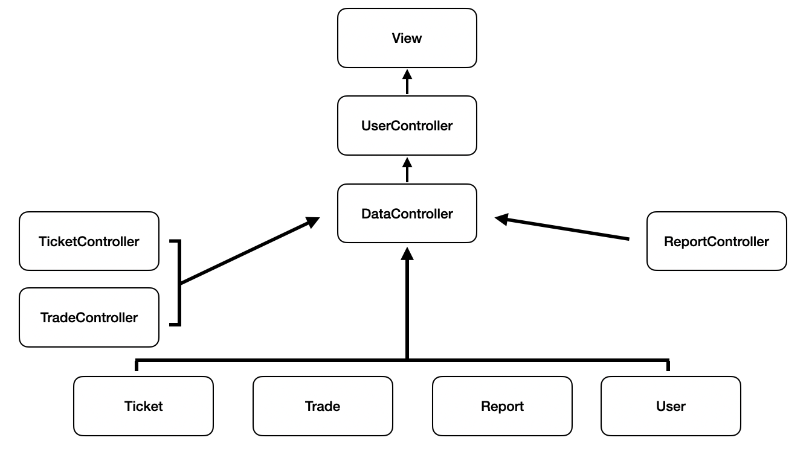

[Figure 3-1] Domain Diagram

### 3.1 Class Description

#### 1) View

View는 사용자 인터페이스를 통해 사용자의 입력을 받고, 처리 결과를 각 Controller로부터 받아 사용자에게 보여주는 GUI 모듈이다.

사용자는 View를 통해 회원가입, 로그인, 티켓 등록, 티켓 검색, 티켓 상세 조회 기능을 사용할 수 있다. 또한 거래 요청, 거래 수락, 거래 상태 확인, 신고 기능도 View를 통해 수행할 수 있다.

#### 2) UserController

UserController는 사용자 계정 관련 기능을 처리하는 모듈이다.

회원가입과 로그인 요청을 처리한다. 사용자가 입력한 ID, 비밀번호, 이메일 등의 정보를 확인한다.

필요한 경우 DataController를 통해 사용자 정보를 저장하거나 조회한다. 로그인 성공 여부를 판단하여 사용자가 시스템의 주요 기능을 사용할 수 있도록 한다.

#### 3) TicketController

TicketController는 티켓 관련 기능을 처리하는 모듈이다.

티켓 등록, 티켓 검색, 티켓 상세 조회 기능을 담당한다. 사용자가 공연명, 공연 날짜, 공연 시간, 좌석, 가격, 거래 방식 등을 입력하면 이를 DataController에 전달한다.

DataController는 전달받은 티켓 정보를 저장한다. 또한 TicketController는 사용자의 검색 조건에 맞는 티켓 정보를 조회한다. 선택된 티켓의 상세 정보도 View에 전달한다.

#### 4) TradeController

TradeController는 사용자 간 티켓 거래 기능을 처리하는 모듈이다.

거래 요청, 거래 수락, 거래 상태 확인 기능을 담당한다. 구매자가 특정 티켓에 대해 거래 요청을 보내면 거래 정보를 생성한다.

판매자가 요청을 수락하면 거래 상태와 티켓 상태를 변경한다. 사용자가 거래 내역을 확인할 때 거래 상태 정보를 제공한다.

거래 상태에는 요청됨, 수락됨, 진행 중, 완료, 취소 등이 포함될 수 있다.

#### 5) ReportController

ReportController는 신고 기능을 처리하는 모듈이다.

사용자가 부적절한 티켓 게시글이나 의심스러운 사용자를 신고할 때 사용된다. 신고 대상, 신고자, 신고 사유를 확인한다.

확인된 신고 정보를 DataController에 전달하여 저장한다. 저장된 신고 정보는 안전한 거래 환경을 유지하기 위한 자료로 사용될 수 있다.

#### 6) DataController

DataController는 시스템에서 사용하는 데이터를 저장하고 조회하는 모듈이다.

사용자 정보, 티켓 정보, 거래 정보, 신고 정보를 관리한다. 각 Controller의 요청에 따라 필요한 데이터를 데이터베이스에서 가져온다.

새로운 데이터가 생성되면 이를 데이터베이스에 저장한다. 또한 티켓 상태, 거래 상태, 신고 상태와 같은 주요 데이터를 일관성 있게 관리한다.

#### 7) User

User는 시스템을 사용하는 일반 사용자를 나타내는 클래스이다.

사용자는 티켓을 등록하는 판매자가 될 수 있다. 또한 티켓을 검색하고 거래를 요청하는 구매자가 될 수도 있다.

User는 사용자 계정 정보와 사용자 상태 정보를 가진다.

#### 8) Ticket

Ticket은 사용자가 등록한 공연 티켓 정보를 나타내는 클래스이다.

공연명, 공연 날짜, 공연 시간, 좌석, 가격 등의 정보를 포함한다. Ticket은 판매자 정보와 티켓 거래 상태도 함께 가진다.

티켓 상태는 거래 가능, 거래 요청됨, 거래 진행 중, 거래 완료 등으로 관리될 수 있다.

#### 9) Trade

Trade는 사용자 간 티켓 거래 정보를 나타내는 클래스이다.

구매자가 거래 요청을 보내면 Trade 객체가 생성된다. 판매자가 거래 요청을 수락하면 거래 상태가 변경된다.

Trade는 티켓 정보, 구매자 정보, 판매자 정보, 거래 상태 정보를 가진다.

#### 10) Report

Report는 사용자가 신고한 게시글 또는 사용자에 대한 신고 정보를 나타내는 클래스이다.

신고자, 신고 대상, 신고 사유, 신고 날짜 등의 정보를 포함한다. 신고 정보는 안전한 거래 환경을 유지하기 위해 사용된다.

## 4. User Interface prototype

### 4.1 Sign Up

그림 4-1은 사용자가 Performance Ticket Trading System에 계정을 생성하기 위한 회원가입 화면이다.

  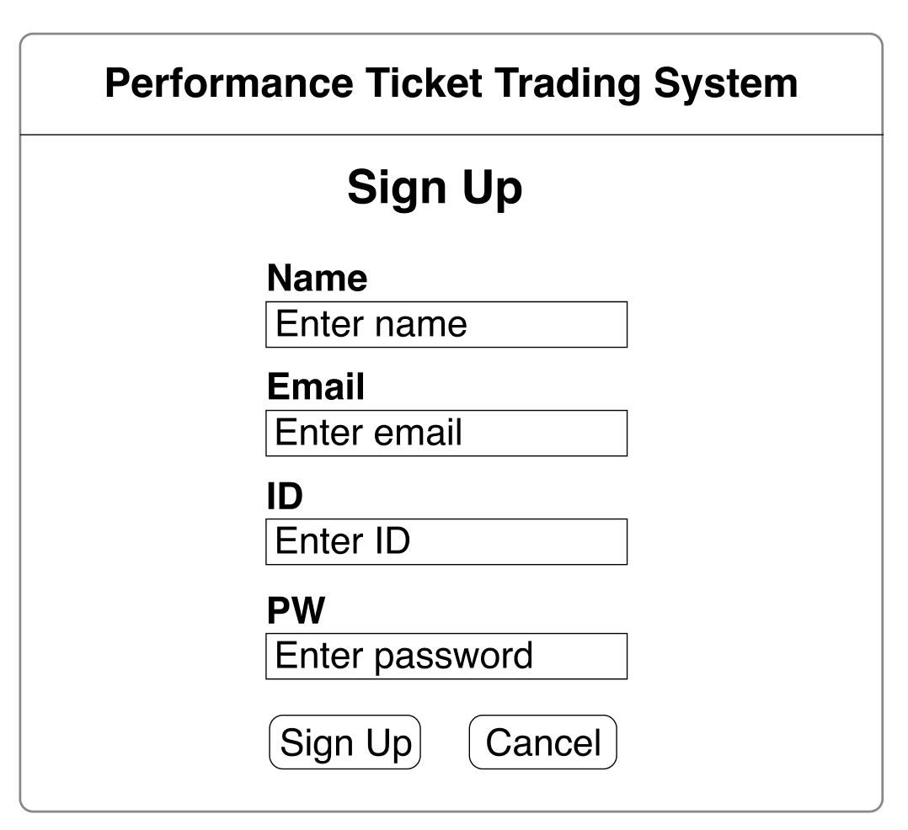

[Figure 4-1] Sign Up

사용자는 이름, 이메일, ID, 비밀번호를 입력한 뒤 “Sign Up” 버튼을 눌러 회원가입을 진행할 수 있다. 입력한 정보가 올바르지 않거나 이미 등록된 ID 또는 이메일이 있는 경우, 시스템은 오류 메시지를 보여주고 사용자가 정보를 다시 입력할 수 있도록 한다.

---

### 4.2 Login

그림 4-2는 사용자가 시스템에 로그인하기 위한 화면이다.

  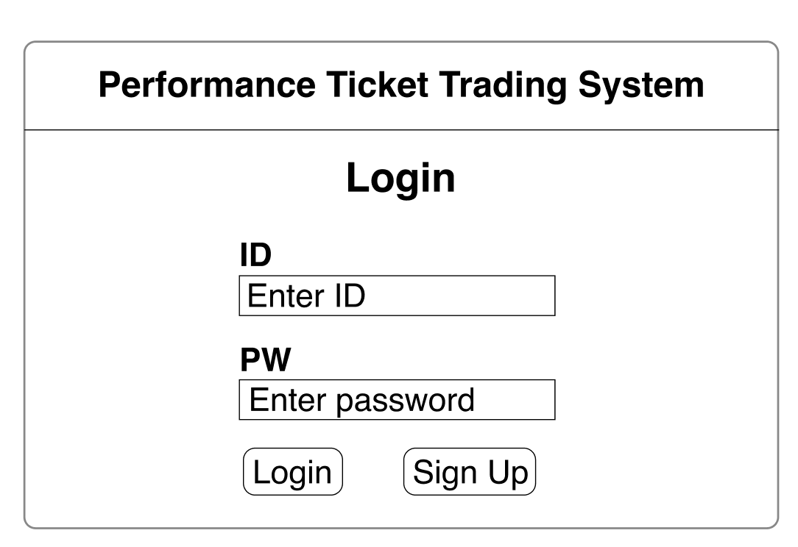

[Figure 4-2] Login

사용자는 ID와 비밀번호를 입력한 뒤 “Login” 버튼을 눌러 시스템에 접속할 수 있다. “Sign Up” 버튼을 누르면 회원가입 화면으로 이동할 수 있다. 로그인에 성공하면 사용자는 티켓 등록, 티켓 검색, 거래 요청, 거래 상태 확인 등의 기능을 사용할 수 있다.

---

### 4.3 Register Ticket

그림 4-3은 사용자가 보유한 공연 티켓 정보를 시스템에 등록하기 위한 화면이다.

  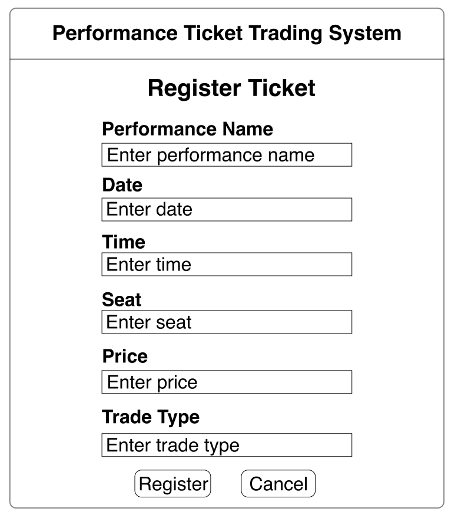

[Figure 4-3] Register Ticket

사용자는 공연명, 공연 날짜, 공연 시간, 좌석, 가격, 거래 방식 등의 정보를 입력할 수 있다. “Register” 버튼을 누르면 시스템은 입력된 티켓 정보를 확인한 뒤 티켓을 등록하고, “Cancel” 버튼을 누르면 티켓 등록을 취소할 수 있다.

---

### 4.4 Search Ticket

그림 4-4는 사용자가 원하는 조건에 따라 티켓을 검색하는 화면이다.

  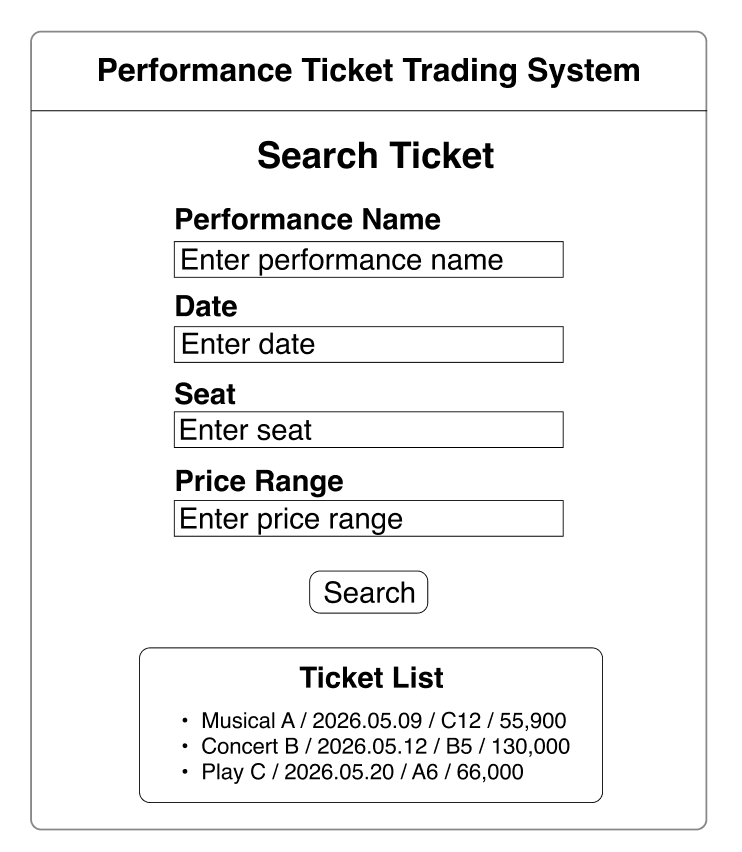

[Figure 4-4] Search Ticket

사용자는 공연명, 날짜, 좌석, 가격 범위 등의 조건을 입력하여 원하는 티켓을 찾을 수 있다. “Search” 버튼을 누르면 시스템은 입력된 조건에 맞는 티켓 목록을 보여주며, 사용자는 검색 결과 중 하나를 선택하여 상세 정보를 확인할 수 있다.

---

### 4.5 View Ticket Detail

그림 4-5는 사용자가 선택한 티켓의 상세 정보를 확인하는 화면이다.

  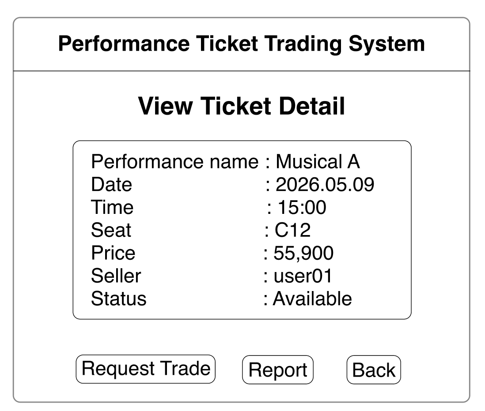

[Figure 4-5] View Ticket Detail

사용자는 공연명, 공연 날짜, 공연 시간, 좌석, 가격, 판매자 정보, 티켓 상태를 확인할 수 있다. 거래를 원할 경우 “Request Trade” 버튼을 누를 수 있으며, 부적절한 게시글이라고 판단될 경우 “Report” 버튼을 눌러 신고할 수 있다.

---

### 4.6 Request Trade

그림 4-6은 사용자가 원하는 티켓에 대해 거래 요청을 보내는 화면이다.

  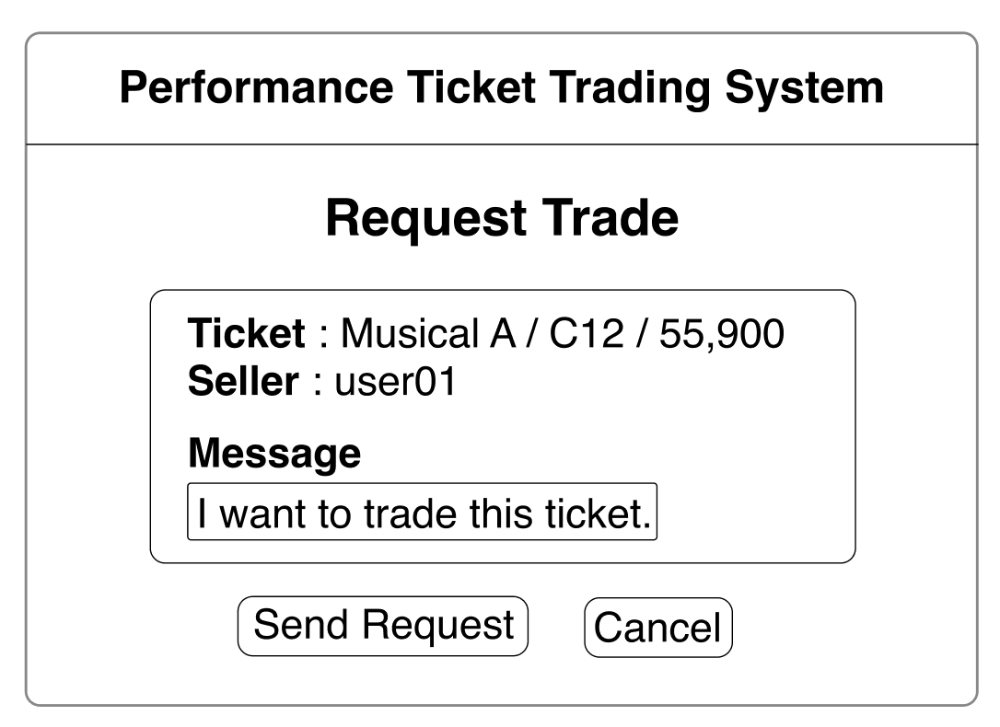

[Figure 4-6] Request Trade

사용자는 선택한 티켓 정보와 판매자 정보를 확인한 뒤, 거래 요청 메시지를 입력할 수 있다. “Send Request” 버튼을 누르면 시스템은 거래 요청 정보를 생성하고, 해당 거래 상태를 요청 상태로 저장한다.

---

### 4.7 Accept Trade

그림 4-7은 판매자가 받은 거래 요청을 확인하고 수락하는 화면이다.

  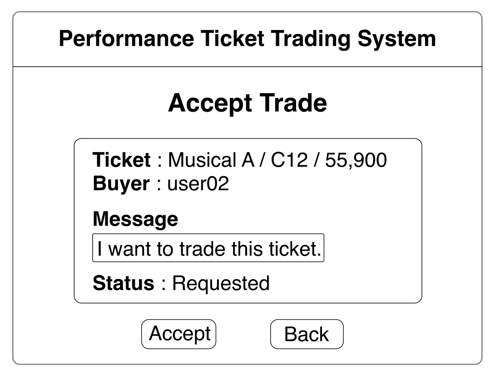

[Figure 4-7] Accept Trade

판매자는 요청된 티켓 정보, 구매자 정보, 요청 메시지, 거래 상태를 확인할 수 있다. “Accept” 버튼을 누르면 거래 요청 상태가 수락 상태로 변경되고, “Back” 버튼을 누르면 이전 화면으로 돌아갈 수 있다.

---

### 4.8 Check Trade Status

그림 4-8은 사용자가 자신의 거래 상태를 확인하는 화면이다.

  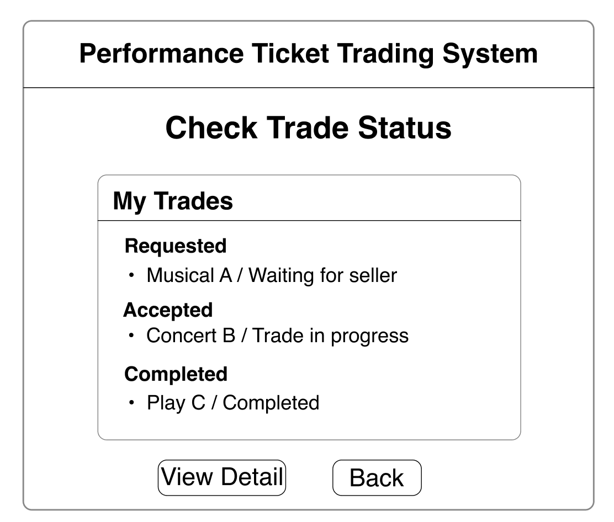

[Figure 4-8] Check Trade Status

사용자는 자신이 요청한 거래와 진행 중인 거래, 완료된 거래를 목록 형태로 확인할 수 있다. 각 거래는 요청 대기, 거래 진행, 거래 완료 등의 상태로 구분되며, 사용자는 필요한 경우 상세 정보를 확인할 수 있다.

---

### 4.9 Report

그림 4-9는 사용자가 부적절한 티켓 게시글이나 의심스러운 사용자를 신고하는 화면이다.

  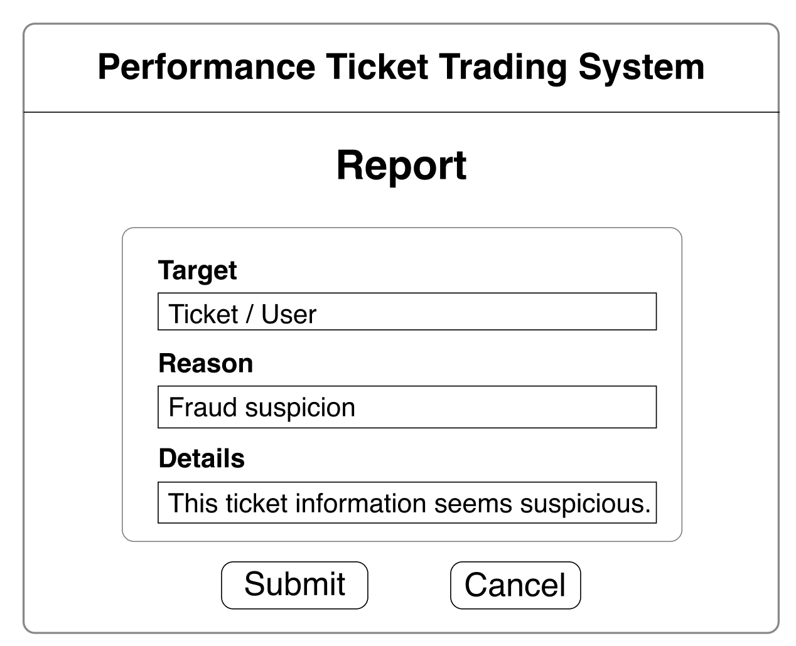

[Figure 4-9] Report

사용자는 신고 대상, 신고 사유, 상세 내용을 입력한 뒤 “Submit” 버튼을 눌러 신고 정보를 제출할 수 있다. 시스템은 제출된 신고 정보를 저장하여 서비스의 신뢰성과 안전성을 높이는 데 활용한다.

## 5. Glossary

| Term | Description |
|---|---|
| User | 시스템을 이용하여 티켓을 등록하고 거래하는 일반 사용자이다. |
| Ticket | 공연명, 날짜, 좌석, 가격 등의 정보를 포함하는 공연 티켓 데이터이다. |
| Trade | 사용자 간 티켓 거래 요청 및 진행 과정을 의미한다. |
| Report | 부적절한 티켓 게시글이나 의심스러운 사용자를 신고하는 기능이다. |
| Controller | 사용자의 요청을 처리하고 필요한 데이터를 관리하는 클래스이다. |
| UserController | 회원가입과 로그인 같은 사용자 계정 관련 기능을 처리하는 클래스이다. |
| TicketController | 티켓 등록, 티켓 검색, 티켓 상세 조회 기능을 처리하는 클래스이다. |
| TradeController | 거래 요청, 거래 수락, 거래 상태 확인 기능을 처리하는 클래스이다. |
| ReportController | 신고 대상, 신고 사유, 상세 내용 등 신고 관련 기능을 처리하는 클래스이다. |
| DataController | 사용자, 티켓, 거래, 신고 정보를 통합적으로 저장하고 관리하는 클래스이다. |
| View | 사용자가 시스템을 이용하기 위해 보는 화면 또는 사용자 인터페이스이다. |

---

## 6. References
