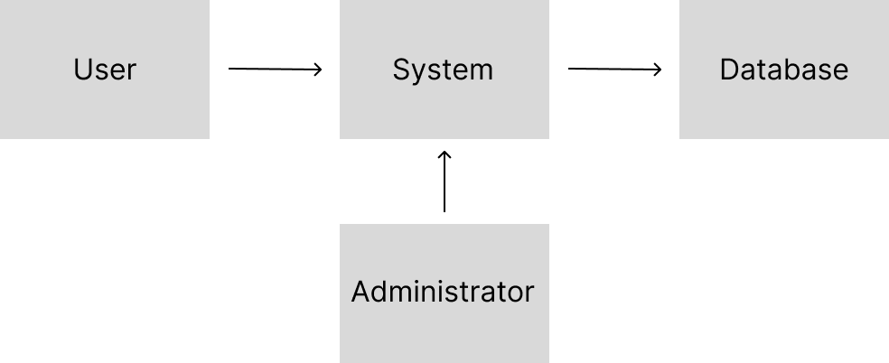

  

# 🎟️ Performance Ticket Trading System

## Info
- Student No: 22412088
- Name: 윤정은
- E-mail: wjdsl59@yu.ac.kr

## Revision History
| Revision date | Version | Description | Author |
|---------------|---------|-------------|--------|
| 2026-03-27 | 1.0 | Final version | 윤정은 |

## = Contents =

1. [Business purpose](#1-business-purpose)  
2. [System context diagram](#2-system-context-diagram)  
3. [Use case list](#3-use-case-list)  
4. [Concept of operation](#4-concept-of-operation)  
5. [Problem statement](#5-problem-statement)  
6. [Glossary](#6-glossary)  
7. [References](#7-references)  

## 1. Business purpose

### 1.1 Project background
최근 콘서트, 뮤지컬, 연극과 같은 다양한 공연 산업이 활성화되면서 공연 티켓에 대한 수요가 증가하고 있다. 그러나 공연 티켓은 특정 날짜와 시간에 맞추어 사용해야하는 특성상, 개인 사정으로 인해 관람이 어려워지는 경우가 자주 발생한다.

이러한 상황에서 많은 사용자들은 개인 간 거래를 통해 티켓을 양도하거나 교환하려고 한다. 하지만 기존의 중고 거래 플랫폼이나 개인 간 거래 방식은 거래 상대방에 대한 신뢰를 확보하기 어렵고, 사기 피해가 발생할 가능성이 존재한다. 특히 공연 티켓은 공연 종류, 날짜, 좌석, 가격 등 다양한 조건을 포함하고 있어 일반적인 거래 방식으로는 원하는 조건의 티켓을 찾기 어려운 문제가 있다.

또한 거래 과정에서 거래 상태를 명확하게 확인하기 어렵고, 거래 이력이나 사용자 정보가 부족하여 안전한 거래 환경이 충분히 보장되지 않는 한계가 있다.

따라서 이러한 문제를 해결하기 위해 사용자 간 신뢰를 기반으로 한 공연 티켓 거래를 지원하는 시스템의 필요성이 증가하고 있다.

### 1.2 Goal

- 사용자가 다양한 공연 티켓을 등록하고 원하는 조건에 따라 검색할 수 있어야 한다.
- 사용자 간 티켓 거래 요청 및 수락/거절 기능을 제공하여 거래 과정을 지원해야 한다.
- 거래 상태를 명확하게 확인할 수 있도록 하여 사용자 편의성을 높여야 한다.
- 신고 및 사용자 관리 기능을 통해 안전한 거래 환경을 제공할 수 있어야 한다.

### 1.3 Target market
- 콘서트, 뮤지컬, 연극 등 다양한 공연 티켓을 거래하려는 사용자
- 개인 사정으로 인해 티켓을 양도하거나 교환하려는 사용자
- 원하는 공연 티켓을 보다 안전하게 구매하고자 하는 사용자

## 2. System context diagram

- User 사용자  
- Administrator 관리자  
- System 시스템  
- Database 데이터 저장소

사용자는 시스템을 통해 공연 티켓을 등록, 검색, 거래할 수 있으며,  
시스템은 데이터베이스에 사용자 정보 및 거래 정보를 저장하고 관리한다.  
관리자는 사용자 및 거래 데이터를 관리하고, 시스템의 안정적인 운영을 지원한다.

## 3. Use case list

| No | Use case | Actor | Description |
|----|----------|--------|-------------|
| 1 | 회원가입 | User | 사용자는 시스템에 계정을 생성하기 위해 회원가입을 진행한다. |
| 2 | 로그인 | User | 사용자는 자신의 계정 정보를 입력하여 시스템에 로그인한다. |
| 3 | 티켓 등록 | User | 사용자는 보유한 공연 티켓 정보를 입력하여 시스템에 등록한다. |
| 4 | 티켓 검색 | User | 사용자는 공연명, 날짜, 좌석 등 조건을 기반으로 티켓을 검색할 수 있다. |
| 5 | 티켓 상세 조회 | User | 사용자는 선택한 티켓의 상세 정보를 확인할 수 있다. |
| 6 | 거래 요청 | User | 사용자는 원하는 티켓에 대해 거래 요청을 보낼 수 있다. |
| 7 | 거래 수락 | User | 사용자는 받은 거래 요청을 수락할 수 있다. |
| 8 | 거래 상태 확인 | User | 사용자는 진행 중인 거래의 상태를 확인할 수 있다. |
| 9 | 신고 | User | 사용자는 부적절한 게시글이나 사용자를 신고할 수 있다. |

## 4. Concept of operation

### 1) 회원가입

| Purpose | 사용자가 시스템을 이용하기 위해 계정을 생성한다. |
|--------|----------------------------------------------|
| Approach | 사용자가 회원가입 화면에서 필요한 정보를 입력하고 가입 요청을 하면, 시스템은 입력된 정보를 저장하고 계정을 생성한다. |
| Dynamics | 사용자가 처음 시스템을 이용할 때 |
| Goals | 사용자가 시스템에 접근할 수 있도록 계정을 생성한다. |

---

### 2) 로그인

| Purpose | 등록된 사용자만 시스템을 이용할 수 있도록 인증한다. |
|--------|----------------------------------------------|
| Approach | 사용자가 ID와 비밀번호를 입력하면 시스템은 데이터베이스와 비교하여 로그인 여부를 판단한다. |
| Dynamics | 사용자가 시스템에 접속할 때 |
| Goals | 인증된 사용자만 기능을 사용할 수 있도록 한다. |

---

### 3) 티켓 등록

| Purpose | 사용자가 보유한 공연 티켓을 시스템에 등록한다. |
|--------|----------------------------------------------|
| Approach | 사용자가 공연 정보, 날짜, 좌석, 가격 등을 입력하면 시스템은 이를 저장한다. |
| Dynamics | 사용자가 티켓을 판매하거나 교환하려 할 때 |
| Goals | 티켓 정보를 시스템에 저장한다. |

---

### 4) 티켓 검색

| Purpose | 사용자가 원하는 조건의 티켓을 찾을 수 있도록 한다. |
|--------|----------------------------------------------|
| Approach | 사용자가 공연명, 날짜, 좌석 등의 조건을 입력하면 시스템은 해당 조건에 맞는 티켓을 검색하여 제공한다. |
| Dynamics | 사용자가 티켓을 찾고자 할 때 |
| Goals | 사용자가 원하는 티켓을 쉽게 찾을 수 있도록 한다. |

---

### 5) 티켓 상세 조회

| Purpose | 사용자가 선택한 티켓의 상세 정보를 확인할 수 있도록 한다. |
|--------|----------------------------------------------|
| Approach | 사용자가 특정 티켓을 선택하면 시스템은 해당 티켓의 상세 정보를 보여준다. |
| Dynamics | 사용자가 티켓을 클릭했을 때 |
| Goals | 티켓 정보를 상세하게 제공한다. |

---

### 6) 거래 요청

| Purpose | 사용자가 원하는 티켓에 대해 거래를 요청할 수 있도록 한다. |
|--------|----------------------------------------------|
| Approach | 사용자가 거래 요청 버튼을 누르면 시스템은 해당 요청을 판매자에게 전달한다. |
| Dynamics | 사용자가 거래를 원하는 경우 |
| Goals | 사용자 간 거래를 시작할 수 있도록 한다. |

---

### 7) 거래 수락

| Purpose | 판매자가 거래 요청을 승인할 수 있도록 한다. |
|--------|----------------------------------------------|
| Approach | 판매자가 요청을 확인하고 수락하면 시스템은 거래 상태를 업데이트한다. |
| Dynamics | 판매자가 요청을 확인할 때 |
| Goals | 거래를 진행 상태로 변경한다. |

---

### 8) 거래 상태 확인

| Purpose | 사용자가 현재 거래 진행 상태를 확인할 수 있도록 한다. |
|--------|----------------------------------------------|
| Approach | 사용자가 거래 내역을 조회하면 시스템은 현재 상태를 표시한다. |
| Dynamics | 사용자가 거래 진행 상황을 확인할 때 |
| Goals | 거래 상태를 명확하게 제공한다. |

---

### 9) 신고

| Purpose | 부적절한 사용자나 게시글을 신고할 수 있도록 한다. |
|--------|----------------------------------------------|
| Approach | 사용자가 신고 버튼을 누르면 시스템은 신고 내용을 저장하고 관리자에게 전달한다. |
| Dynamics | 문제가 발생한 경우 |
| Goals | 안전한 거래 환경을 유지한다. |

## 5. Problem statement

### 5.1 거래 신뢰성 문제
개인 간 티켓 거래에서는 거래 상대방에 대한 신뢰를 확보하기 어렵다.  
이로 인해 사기 피해가 발생할 가능성이 존재한다.  
시스템은 사용자 인증, 거래 기록 관리, 신고 기능 등을 통해 신뢰성을 확보할 수 있어야 한다.

---

### 5.2 티켓 정보 관리
공연 티켓은 공연 종류, 날짜, 좌석, 가격 등 다양한 정보를 포함한다.  
이러한 정보를 효율적으로 저장하고 관리할 수 있어야 하며, 사용자에게 정확한 정보를 제공할 수 있어야 한다.

---

### 5.3 티켓 검색 및 접근성
사용자는 원하는 조건의 티켓을 빠르게 찾을 수 있어야 한다.  
이를 위해 공연명, 날짜, 좌석 등의 조건을 기반으로 효율적인 검색 기능을 제공해야 한다.

---

### 5.4 거래 상태 관리
거래 진행 과정에서 현재 상태를 명확하게 확인할 수 있어야 한다.  
거래 요청, 수락, 완료 등의 상태를 체계적으로 관리하여 사용자 혼란을 방지해야 한다.

---

### 5.5 사용자 편의성
시스템은 사용자가 쉽게 접근하고 이용할 수 있도록 직관적인 인터페이스를 제공해야 한다.  
복잡하지 않고 간단한 구조를 유지하는 것이 중요하다.

---

### 5.6 Non-Functional Requirements (NFRs)

- Performance: 빠른 응답 속도 제공  
- Security: 사용자 및 거래 정보 보호  
- Availability: 안정적인 서비스 제공  
- Usability: 직관적인 UI/UX 제공  
- Scalability: 사용자 증가 시 확장 가능

## 6. Glossary

| 용어 | 설명 |
|------|------|
| User | 공연 티켓을 등록, 검색, 거래하는 사용자 |
| Administrator | 사용자 및 신고 내역을 관리하는 관리자 |
| System | 공연 티켓 거래를 지원하는 시스템 |
| Core | 시스템의 핵심 기능을 처리하는 부분 |
| Data | 사용자 정보, 티켓 정보, 거래 정보를 저장하는 부분 |
| Ticket | 공연 티켓 정보 |
| Trade | 티켓 거래 정보 |

## 7. References

- None
