

  

<h1 align="center">Performance Ticket Trading System</h1>

## Info

- Student No: 22412088
- Name: 윤정은
- E-mail: wjdsl59@yu.ac.kr

## Revision History

| Revision date | Version | Description | Author |
|---|---|---|---|
| 2026-06-05 | 1.0 | Design phase final version | 윤정은 |

# Contents

1. [Introduction](#1-introduction)
2. [Class diagram](#2-class-diagram)
3. [Sequence diagram](#3-sequence-diagram)
4. [State machine diagram](#4-state-machine-diagram)
5. [Implementation requirements](#5-implementation-requirements)
6. [Glossary](#6-glossary)
7. [References](#7-references)

---

# 1. Introduction

본 문서는 Analysis 단계의 문서에 이어지는 Design 단계의 문서이다.  
Analysis 단계에서 정의한 Performance Ticket Trading System의 Use case, Domain Analysis, User Interface Prototype을 바탕으로, 본 문서에서는 실제 구현을 위한 클래스 구조, 기능 흐름, 상태 변화, 구현 요구사항을 설계한다.

## 1.1 Summary

최근 콘서트, 뮤지컬, 연극과 같은 공연 산업이 활성화되면서 공연 티켓에 대한 수요가 증가하고 있다. 공연 티켓은 특정 날짜와 시간에 맞추어 사용해야 하므로, 개인 사정으로 관람이 어려워진 사용자가 티켓을 양도하거나 교환하려는 경우가 자주 발생한다.

그러나 기존의 중고 거래 플랫폼이나 개인 간 거래 방식은 공연 티켓 거래에 최적화되어 있지 않아, 공연명, 날짜, 좌석, 가격, 거래 상태 등의 정보를 체계적으로 관리하기 어렵다. 또한 거래 요청과 수락 과정이 명확하게 정리되지 않으면 사용자 간 혼란이 발생할 수 있다.

따라서 본 문서에서는 사용자 간 공연 티켓 거래를 보다 안전하고 편리하게 지원하기 위한 Performance Ticket Trading System의 설계 내용을 제시한다. 이 시스템은 회원가입, 로그인, 티켓 등록, 티켓 검색, 티켓 상세 조회, 거래 요청, 거래 수락, 거래 상태 확인, 신고 기능을 중심으로 구성된다. Design 단계에서는 이러한 기능들이 어떤 클래스와 메서드를 통해 동작하는지, 그리고 각 기능이 어떤 순서로 처리되는지를 구체적으로 정의한다.

## 1.2 Important Points of Design

- 사용자 기능 중심의 구조 설계
- 티켓 정보의 체계적인 저장 및 조회
- 거래 요청과 거래 상태 변화의 명확한 관리
- 신고 기능을 통한 안전한 거래 환경 지원
- View와 Controller의 역할 분리
- 구현이 쉬운 클래스 및 메서드 구조 설계

---

# 2. Class diagram

본 프로젝트는 웹 기반 시스템으로 구현한다. 따라서 클래스 다이어그램은 사용자가 직접 상호작용하는 View 부분과, 시스템의 주요 기능과 데이터를 처리하는 Core 부분으로 나누어 설계한다.

View 부분은 회원가입, 로그인, 티켓 등록, 티켓 검색, 티켓 상세 조회, 거래 요청, 거래 수락, 거래 상태 확인, 신고 화면을 포함한다. Core 부분은 사용자의 요청을 처리하는 Controller 클래스와 시스템의 주요 데이터를 나타내는 Data 클래스로 구성된다.

본 프로젝트에서 특정한 디자인 패턴을 엄격하게 적용하기보다는, View와 Controller의 역할을 분리하여 화면 처리와 비즈니스 로직이 지나치게 섞이지 않도록 설계한다. 사용자의 입력은 View를 통해 각 Controller에 전달되고, 각 Controller는 해당 요청을 처리한 뒤 DataController를 통해 필요한 데이터를 저장하거나 조회한다.

  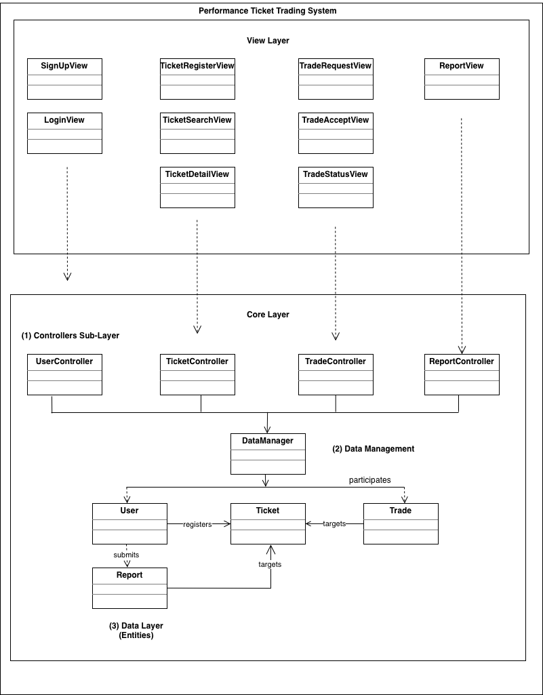

  Fig. 1. Overall Simple Class Diagram

Fig. 1은 Performance Ticket Trading System의 전체 클래스 구조를 나타낸다. View는 사용자의 입력을 받아 각 Controller에 전달한다. UserController는 회원가입과 로그인 기능을 담당하고, TicketController는 티켓 등록, 티켓 검색, 티켓 상세 조회 기능을 담당한다. TradeController는 거래 요청, 거래 수락, 거래 상태 확인 기능을 담당하며, ReportController는 신고 기능을 담당한다.

DataController는 각 Controller와 User, Ticket, Trade, Report 데이터 클래스 사이에서 데이터를 저장하고 조회하는 역할을 한다. 이를 통해 View와 데이터 클래스가 직접 연결되지 않도록 하며, 시스템의 구조를 보다 명확하게 유지한다.

## 2.1 View Class Diagram

View 계층을 구성하는 클래스 다이어그램을 설명한다. 본 프로젝트는 사용자가 공연 티켓을 등록하고, 검색하고, 거래를 요청하며, 거래 상태를 확인할 수 있는 시스템이다. 따라서 View 계층은 사용자가 직접 마주하는 화면을 구성하고, 사용자의 입력을 받아 Controller 계층으로 전달하는 역할을 담당한다.

View 계층에는 로그인, 회원가입, 티켓 목록 조회, 티켓 상세 조회, 티켓 등록, 거래 요청, 거래 상태 확인, 신고 화면이 포함된다. 각 화면은 하나의 View 클래스로 표현되며, 사용자의 버튼 클릭이나 입력값 제출과 같은 이벤트를 처리하기 위한 메서드를 가진다. 그러나 View 클래스는 실제 거래 처리, 티켓 저장, 신고 접수와 같은 핵심 로직을 직접 수행하지 않는다. 이러한 처리는 Controller 및 Core 계층에서 담당하며, View 계층은 화면 표시와 입력 전달에 집중한다.

설명에 앞서, 다이어그램 내부의 클래스 이름과 메서드 이름은 영어로 표시하였다. 이는 실제 구현 시 클래스명과 함수명으로 사용할 수 있도록 하기 위한 것이다. 또한 BaseView는 여러 View 클래스가 공통적으로 가지는 화면 출력, 메시지 표시, 입력값 검증 기능을 정의하는 상위 클래스이다. 각 View 클래스는 BaseView를 상속받아 공통 기능을 재사용한다.

  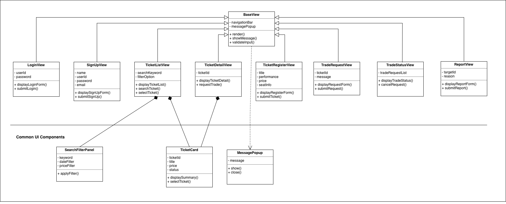

  Fig. 2. View Class Diagram

Fig. 2는 View를 구성하는 클래스 다이어그램이다. BaseView는 모든 View 클래스의 공통 상위 클래스로, 화면을 출력하는 `render()`, 안내 또는 오류 메시지를 표시하는 `showMessage()`, 입력값을 검증하는 `validateInput()` 메서드를 가진다. 이를 통해 각 화면 클래스에서 반복적으로 사용되는 기능을 하나의 상위 클래스로 묶을 수 있다.

LoginView와 SignUpView는 사용자 인증과 관련된 화면을 담당한다. LoginView는 사용자가 아이디와 비밀번호를 입력하여 로그인할 수 있도록 하며, `submitLogin()` 메서드를 통해 입력된 로그인 정보를 Controller로 전달한다. SignUpView는 이름, 아이디, 비밀번호, 이메일과 같은 회원가입 정보를 입력받고, `submitSignUp()` 메서드를 통해 회원가입 요청을 전달한다.

TicketListView, TicketDetailView, TicketRegisterView는 티켓 기능과 관련된 화면을 담당한다. TicketListView는 등록된 티켓 목록을 보여주고, 사용자가 검색어 또는 필터 조건을 입력하여 원하는 티켓을 찾을 수 있도록 한다. 이때 SearchFilterPanel은 검색어, 날짜, 가격 조건을 입력받는 공통 UI 구성 요소로 사용되며, TicketCard는 티켓 목록에서 각 티켓의 요약 정보를 표시하는 역할을 한다. TicketDetailView는 선택된 티켓의 상세 정보를 보여주며, TicketCard를 통해 티켓의 주요 정보를 표현한다. TicketRegisterView는 공연명, 공연 날짜, 좌석 정보, 가격 등의 티켓 정보를 입력받아 새로운 티켓을 등록하는 화면을 제공한다.

TradeRequestView와 TradeStatusView는 거래 요청 및 거래 상태 확인 기능을 담당한다. TradeRequestView는 사용자가 특정 티켓에 대해 거래 요청 메시지를 작성하고 제출할 수 있도록 한다. TradeStatusView는 사용자가 자신이 보낸 거래 요청 또는 받은 거래 요청의 상태를 확인할 수 있도록 하며, 필요한 경우 요청을 취소하는 기능도 제공한다.

ReportView는 부적절한 티켓 또는 사용자를 신고하기 위한 화면을 담당한다. 사용자는 신고 대상과 신고 사유를 입력할 수 있으며, `submitReport()` 메서드를 통해 신고 내용을 Controller로 전달한다. 또한 MessagePopup은 오류 메시지, 입력값 검증 결과, 요청 처리 결과와 같은 안내 메시지를 사용자에게 보여주는 공통 UI 구성 요소로 사용된다.

이처럼 View 클래스들은 각각 독립적인 화면 역할을 가지지만, 공통적으로 사용자 입력을 받고 이를 시스템 내부 처리 계층으로 넘기는 구조를 가진다. 따라서 View Class Diagram은 시스템의 화면 구성이 어떤 클래스들로 나누어지는지, 각 화면이 어떤 기능을 담당하는지, 그리고 공통 UI 구성 요소가 어떤 화면에서 사용되는지를 보여준다. View 계층을 별도로 분리함으로써 화면 구성과 핵심 비즈니스 로직을 구분할 수 있으며, 이후 화면이 추가되거나 수정되더라도 전체 시스템 구조를 더 쉽게 유지보수할 수 있다.

## 2.1.1 View Class Diagram Description

### BaseView

| Category | Description |
|---|---|
| Class Description | BaseView는 모든 View 클래스의 공통 상위 클래스이다. 각 화면에서 반복적으로 사용되는 화면 출력, 메시지 표시, 입력값 검증 기능을 정의한다. 이를 통해 View 계층의 구조를 일관성 있게 유지하고, 여러 화면 클래스에서 중복되는 기능을 줄일 수 있다. |

#### Attributes

| Name | Type | Scope | Visibility | Description |
|---|---|---|---|---|
| title | String | instance | protected | 현재 화면의 제목을 저장한다. |
| message | String | instance | protected | 사용자에게 표시할 안내 메시지 또는 오류 메시지를 저장한다. |

#### Operations

| Name | Argument | Returns | Scope | Visibility | Description |
|---|---|---|---|---|---|
| render | none | void | instance | public | 현재 View 화면을 사용자에게 출력한다. |
| showMessage | message: String | void | instance | public | 안내 메시지 또는 오류 메시지를 화면에 표시한다. |
| validateInput | inputData: Object | boolean | instance | public | 사용자가 입력한 값이 올바른 형식인지 확인한다. |

---

### LoginView

| Category | Description |
|---|---|
| Class Description | LoginView는 사용자 로그인 화면을 담당하는 클래스이다. 사용자가 입력한 아이디와 비밀번호를 받아 로그인 요청을 Controller로 전달한다. 일반 사용자와 관리자는 이 화면을 통해 시스템에 접근할 수 있다. |

#### Attributes

| Name | Type | Scope | Visibility | Description |
|---|---|---|---|---|
| userId | String | instance | private | 사용자가 입력한 아이디를 저장한다. |
| password | String | instance | private | 사용자가 입력한 비밀번호를 저장한다. |

#### Operations

| Name | Argument | Returns | Scope | Visibility | Description |
|---|---|---|---|---|---|
| submitLogin | userId: String, password: String | void | instance | public | 입력된 로그인 정보를 Controller로 전달한다. |

---

### SignUpView

| Category | Description |
|---|---|
| Class Description | SignUpView는 회원가입 화면을 담당하는 클래스이다. 사용자가 입력한 이름, 아이디, 비밀번호, 이메일 정보를 받아 회원가입 요청을 Controller로 전달한다. 입력값 검증을 통해 필수 정보 누락이나 잘못된 형식을 확인한다. |

#### Attributes

| Name | Type | Scope | Visibility | Description |
|---|---|---|---|---|
| name | String | instance | private | 사용자가 입력한 이름을 저장한다. |
| userId | String | instance | private | 사용자가 입력한 아이디를 저장한다. |
| password | String | instance | private | 사용자가 입력한 비밀번호를 저장한다. |
| email | String | instance | private | 사용자가 입력한 이메일 주소를 저장한다. |

#### Operations

| Name | Argument | Returns | Scope | Visibility | Description |
|---|---|---|---|---|---|
| submitSignUp | name: String, userId: String, password: String, email: String | void | instance | public | 입력된 회원가입 정보를 Controller로 전달한다. |

---

### TicketListView

| Category | Description |
|---|---|
| Class Description | TicketListView는 등록된 티켓 목록을 화면에 표시하는 클래스이다. 사용자는 검색어 또는 필터 조건을 입력하여 원하는 공연 티켓을 찾을 수 있다. 이 화면은 사용자가 티켓 상세 정보를 확인하기 전에 전체 티켓 목록을 탐색하는 역할을 한다. |

#### Attributes

| Name | Type | Scope | Visibility | Description |
|---|---|---|---|---|
| ticketList | List | instance | private | 화면에 표시할 티켓 목록을 저장한다. |
| searchKeyword | String | instance | private | 사용자가 입력한 검색어를 저장한다. |
| filterCondition | Object | instance | private | 날짜, 지역, 가격 등 사용자가 선택한 필터 조건을 저장한다. |

#### Operations

| Name | Argument | Returns | Scope | Visibility | Description |
|---|---|---|---|---|---|
| displayTicketList | ticketList: List | void | instance | public | 티켓 목록을 화면에 출력한다. |
| searchTicket | keyword: String, filterCondition: Object | void | instance | public | 검색어와 필터 조건을 Controller로 전달한다. |
| selectTicket | ticketId: int | void | instance | public | 사용자가 선택한 티켓의 상세 화면으로 이동한다. |

---

### TicketDetailView

| Category | Description |
|---|---|
| Class Description | TicketDetailView는 선택된 티켓의 상세 정보를 보여주는 클래스이다. 공연명, 공연 날짜, 좌석 정보, 가격, 판매자 정보, 거래 상태 등을 화면에 표시한다. 사용자는 이 화면에서 티켓 정보를 확인한 뒤 거래 요청을 보낼 수 있다. |

#### Attributes

| Name | Type | Scope | Visibility | Description |
|---|---|---|---|---|
| ticketId | int | instance | private | 사용자가 선택한 티켓의 ID를 저장한다. |
| ticketInfo | Ticket | instance | private | 선택된 티켓의 상세 정보를 저장한다. |
| tradeStatus | String | instance | private | 해당 티켓의 현재 거래 상태를 저장한다. |

#### Operations

| Name | Argument | Returns | Scope | Visibility | Description |
|---|---|---|---|---|---|
| displayTicketDetail | ticketId: int | void | instance | public | 선택된 티켓의 상세 정보를 화면에 출력한다. |
| requestTrade | ticketId: int | void | instance | public | 선택된 티켓에 대한 거래 요청을 Controller로 전달한다. |

---

### TicketRegisterView

| Category | Description |
|---|---|
| Class Description | TicketRegisterView는 판매자가 티켓을 등록하는 화면을 담당하는 클래스이다. 공연명, 공연 날짜, 좌석 정보, 가격, 설명과 같은 티켓 정보를 입력받고, 입력값 검증 후 등록 요청을 Controller로 전달한다. |

#### Attributes

| Name | Type | Scope | Visibility | Description |
|---|---|---|---|---|
| performanceTitle | String | instance | private | 판매자가 입력한 공연명을 저장한다. |
| performanceDate | Date | instance | private | 판매자가 입력한 공연 날짜를 저장한다. |
| seatInfo | String | instance | private | 판매자가 입력한 좌석 정보를 저장한다. |
| price | int | instance | private | 판매자가 입력한 티켓 가격을 저장한다. |
| description | String | instance | private | 판매자가 입력한 티켓 설명을 저장한다. |

#### Operations

| Name | Argument | Returns | Scope | Visibility | Description |
|---|---|---|---|---|---|
| submitTicket | ticketInfo: Ticket | void | instance | public | 입력된 티켓 정보를 Controller로 전달하여 티켓 등록을 요청한다. |

---

### TradeRequestView

| Category | Description |
|---|---|
| Class Description | TradeRequestView는 사용자가 선택한 티켓에 대해 거래 요청을 보내는 화면을 담당하는 클래스이다. 구매자는 요청 메시지를 입력하고, 해당 티켓에 대한 거래 요청을 제출할 수 있다. |

#### Attributes

| Name | Type | Scope | Visibility | Description |
|---|---|---|---|---|
| ticketId | int | instance | private | 거래 요청 대상이 되는 티켓의 ID를 저장한다. |
| buyerId | String | instance | private | 거래를 요청한 사용자의 ID를 저장한다. |
| requestMessage | String | instance | private | 구매자가 작성한 거래 요청 메시지를 저장한다. |

#### Operations

| Name | Argument | Returns | Scope | Visibility | Description |
|---|---|---|---|---|---|
| submitTradeRequest | ticketId: int, buyerId: String, requestMessage: String | void | instance | public | 입력된 거래 요청 정보를 Controller로 전달한다. |

---

### TradeAcceptView

| Category | Description |
|---|---|
| Class Description | TradeAcceptView는 판매자가 받은 거래 요청을 확인하고 수락하는 화면을 담당하는 클래스이다. 판매자는 자신이 등록한 티켓에 대한 요청 목록을 확인하고, 그중 하나의 요청을 선택하여 거래를 수락할 수 있다. |

#### Attributes

| Name | Type | Scope | Visibility | Description |
|---|---|---|---|---|
| requestList | List | instance | private | 판매자가 받은 거래 요청 목록을 저장한다. |
| selectedRequestId | int | instance | private | 판매자가 선택한 거래 요청의 ID를 저장한다. |

#### Operations

| Name | Argument | Returns | Scope | Visibility | Description |
|---|---|---|---|---|---|
| displayRequestList | requestList: List | void | instance | public | 판매자가 받은 거래 요청 목록을 화면에 출력한다. |
| acceptTrade | requestId: int | void | instance | public | 선택된 거래 요청을 수락하기 위해 Controller로 요청을 전달한다. |

---

### TradeStatusView

| Category | Description |
|---|---|
| Class Description | TradeStatusView는 사용자의 거래 진행 상태를 확인하는 화면을 담당하는 클래스이다. 사용자는 자신이 요청했거나 받은 거래가 대기 중인지, 수락되었는지, 거절되었는지, 완료되었는지를 확인할 수 있다. |

#### Attributes

| Name | Type | Scope | Visibility | Description |
|---|---|---|---|---|
| tradeList | List | instance | private | 사용자와 관련된 거래 목록을 저장한다. |
| tradeStatus | String | instance | private | 각 거래의 현재 진행 상태를 저장한다. |

#### Operations

| Name | Argument | Returns | Scope | Visibility | Description |
|---|---|---|---|---|---|
| displayTradeStatus | userId: String | void | instance | public | 현재 사용자의 거래 상태 정보를 요청하고 화면에 표시한다. |

---

### ReportView

| Category | Description |
|---|---|
| Class Description | ReportView는 신고 화면을 담당하는 클래스이다. 사용자는 허위 티켓, 부적절한 사용자, 문제 있는 거래 행위 등을 신고할 수 있다. 입력된 신고 정보는 Controller로 전달되어 관리자 처리 과정에 사용된다. |

#### Attributes

| Name | Type | Scope | Visibility | Description |
|---|---|---|---|---|
| targetId | int | instance | private | 신고 대상이 되는 티켓 또는 사용자의 ID를 저장한다. |
| reportReason | String | instance | private | 사용자가 선택한 신고 사유를 저장한다. |
| reportContent | String | instance | private | 사용자가 작성한 상세 신고 내용을 저장한다. |

#### Operations

| Name | Argument | Returns | Scope | Visibility | Description |
|---|---|---|---|---|---|
| submitReport | targetId: int, reportReason: String, reportContent: String | void | instance | public | 입력된 신고 정보를 Controller로 전달한다. |

## 2.2 Core Class Diagram

주요 기능을 구현한 Core 부분의 클래스 다이어그램에 대해 설명한다. Core는 View에서 전달된 사용자의 요청을 처리하고, 시스템의 주요 데이터를 관리하는 프로그램의 핵심 로직이다.

  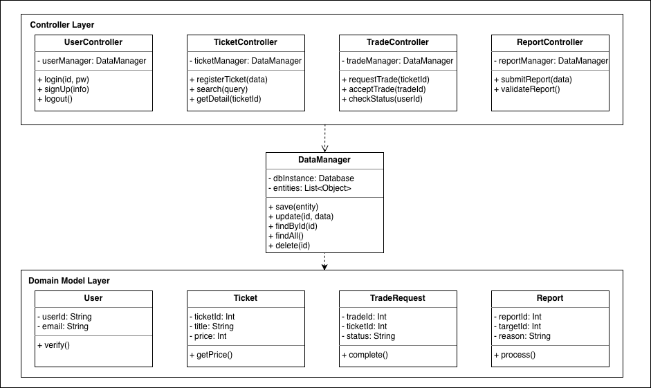

  Fig. 3. Core Class Diagram

Fig. 3은 Performance Ticket Trading System의 Core Class Diagram이다. Core 부분은 Controller Layer, DataManager, Domain Model Layer로 구성된다. Controller Layer는 사용자의 기능 요청을 처리하는 부분이며, DataManager는 데이터 저장, 조회, 수정, 삭제와 같은 공통 데이터 처리 기능을 담당한다. Domain Model Layer는 시스템에서 사용되는 주요 데이터 객체를 나타낸다.

Controller Layer에는 UserController, TicketController, TradeController, ReportController가 포함된다. UserController는 로그인, 회원가입, 로그아웃 기능을 처리한다. TicketController는 티켓 등록, 검색, 상세 조회 기능을 담당한다. TradeController는 거래 요청, 거래 수락, 거래 상태 확인 기능을 처리한다. ReportController는 신고 제출과 신고 검증 기능을 담당한다.

DataManager는 각 Controller에서 필요한 데이터를 공통적으로 관리하는 클래스이다. 각 Controller는 직접 데이터를 저장하거나 조회하지 않고 DataManager를 통해 데이터에 접근한다. 이를 통해 데이터 처리 로직의 중복을 줄이고, 데이터 관리 기능을 하나의 클래스로 분리할 수 있다.

Domain Model Layer에는 User, Ticket, TradeRequest, Report 클래스가 포함된다. User는 사용자 정보를 저장하고, Ticket은 등록된 티켓 정보를 저장한다. TradeRequest는 특정 티켓에 대한 거래 요청 정보를 저장하며, Report는 사용자가 제출한 신고 정보를 저장한다. 이러한 구조를 통해 Core 부분은 기능 처리 로직과 데이터 모델을 분리하여 시스템의 유지보수성과 확장성을 높일 수 있다.

## 2.2.1 Core Class Diagram Description

Core Class Diagram에 포함된 각 클래스의 역할, 속성, 연산을 설명한다. 단순 데이터 저장을 위한 클래스인 User, Ticket, TradeRequest, Report는 주요 속성과 대표 연산을 중심으로 설명한다.

### UserController

| Class Description |  |
|---|---|
| Description | 사용자 인증과 관련된 기능을 처리하는 컨트롤러 클래스이다. 로그인, 회원가입, 로그아웃 요청을 처리하며, 사용자 데이터 관리를 위해 DataManager를 사용한다. |

| Attributes |  |  |  |  |
|---|---|---|---|---|
| Name | Type | Description | Scope | Visibility |
| userManager | DataManager | 사용자 데이터를 저장, 조회, 수정하기 위해 사용하는 DataManager 객체 | instance | private |

| Operations |  |  |  |  |
|---|---|---|---|---|
| Name | Argument | Returns | Scope | Visibility |
| login | id, pw | User | instance | public |
| signUp | info | boolean | instance | public |
| logout | none | void | instance | public |

---

### TicketController

| Class Description |  |
|---|---|
| Description | 티켓 기능을 처리하는 컨트롤러 클래스이다. 티켓 등록, 티켓 검색, 티켓 상세 조회 기능을 담당하며, 티켓 데이터 관리를 위해 DataManager를 사용한다. |

| Attributes |  |  |  |  |
|---|---|---|---|---|
| Name | Type | Description | Scope | Visibility |
| ticketManager | DataManager | 티켓 데이터를 저장, 조회, 수정하기 위해 사용하는 DataManager 객체 | instance | private |

| Operations |  |  |  |  |
|---|---|---|---|---|
| Name | Argument | Returns | Scope | Visibility |
| registerTicket | data | boolean | instance | public |
| search | query | List\<Ticket> | instance | public |
| getDetail | ticketId | Ticket | instance | public |

---

### TradeController

| Class Description |  |
|---|---|
| Description | 티켓 거래 요청과 관련된 기능을 처리하는 컨트롤러 클래스이다. 거래 요청, 거래 수락, 거래 상태 확인 기능을 담당하며, 거래 요청 데이터 관리를 위해 DataManager를 사용한다. |

| Attributes |  |  |  |  |
|---|---|---|---|---|
| Name | Type | Description | Scope | Visibility |
| tradeManager | DataManager | 거래 요청 데이터를 저장, 조회, 수정하기 위해 사용하는 DataManager 객체 | instance | private |

| Operations |  |  |  |  |
|---|---|---|---|---|
| Name | Argument | Returns | Scope | Visibility |
| requestTrade | ticketId | TradeRequest | instance | public |
| acceptTrade | tradeId | boolean | instance | public |
| checkStatus | userId | List\<TradeRequest> | instance | public |

---

### ReportController

| Class Description |  |
|---|---|
| Description | 신고 기능을 처리하는 컨트롤러 클래스이다. 사용자가 제출한 신고를 저장하고, 신고 내용이 유효한지 검증한다. 신고 데이터 관리를 위해 DataManager를 사용한다. |

| Attributes |  |  |  |  |
|---|---|---|---|---|
| Name | Type | Description | Scope | Visibility |
| reportManager | DataManager | 신고 데이터를 저장, 조회, 수정하기 위해 사용하는 DataManager 객체 | instance | private |

| Operations |  |  |  |  |
|---|---|---|---|---|
| Name | Argument | Returns | Scope | Visibility |
| submitReport | data | boolean | instance | public |
| validateReport | none | boolean | instance | public |

---

### DataManager

| Class Description |  |
|---|---|
| Description | Core 부분에서 공통적으로 사용되는 데이터 관리 클래스이다. 각 Controller가 필요한 데이터를 직접 처리하지 않고 DataManager를 통해 저장, 조회, 수정, 삭제할 수 있도록 한다. |

| Attributes |  |  |  |  |
|---|---|---|---|---|
| Name | Type | Description | Scope | Visibility |
| dbInstance | Database | 데이터 저장소에 접근하기 위한 Database 객체 | instance | private |
| entities | List\<Object> | 시스템에서 관리하는 데이터 객체 목록 | instance | private |

| Operations |  |  |  |  |
|---|---|---|---|---|
| Name | Argument | Returns | Scope | Visibility |
| save | entity | boolean | instance | public |
| update | id, data | boolean | instance | public |
| findById | id | Object | instance | public |
| findAll | none | List\<Object> | instance | public |
| delete | id | boolean | instance | public |

---

### User

| Class Description |  |
|---|---|
| Description | 시스템을 사용하는 사용자의 정보를 저장하는 도메인 모델 클래스이다. 사용자 ID와 이메일 정보를 포함하며, 사용자 정보 확인 기능을 가진다. |

| Attributes |  |  |  |  |
|---|---|---|---|---|
| Name | Type | Description | Scope | Visibility |
| userId | String | 사용자를 구분하기 위한 고유 ID | instance | private |
| email | String | 사용자의 이메일 주소 | instance | private |

| Operations |  |  |  |  |
|---|---|---|---|---|
| Name | Argument | Returns | Scope | Visibility |
| verify | none | boolean | instance | public |

---

### Ticket

| Class Description |  |
|---|---|
| Description | 등록된 공연 티켓 정보를 저장하는 도메인 모델 클래스이다. 티켓 ID, 공연 제목, 가격 정보를 포함하며, 티켓 가격을 반환하는 기능을 가진다. |

| Attributes |  |  |  |  |
|---|---|---|---|---|
| Name | Type | Description | Scope | Visibility |
| ticketId | Int | 티켓을 구분하기 위한 고유 ID | instance | private |
| title | String | 공연 또는 티켓의 제목 | instance | private |
| price | Int | 티켓의 거래 가격 | instance | private |

| Operations |  |  |  |  |
|---|---|---|---|---|
| Name | Argument | Returns | Scope | Visibility |
| getPrice | none | Int | instance | public |

---

### TradeRequest

| Class Description |  |
|---|---|
| Description | 특정 티켓에 대한 거래 요청 정보를 저장하는 도메인 모델 클래스이다. 거래 요청 ID, 티켓 ID, 거래 상태 정보를 포함하며, 거래 완료 처리를 수행할 수 있다. |

| Attributes |  |  |  |  |
|---|---|---|---|---|
| Name | Type | Description | Scope | Visibility |
| tradeId | Int | 거래 요청을 구분하기 위한 고유 ID | instance | private |
| ticketId | Int | 거래 요청 대상이 되는 티켓 ID | instance | private |
| status | String | 거래 요청의 현재 상태 | instance | private |

| Operations |  |  |  |  |
|---|---|---|---|---|
| Name | Argument | Returns | Scope | Visibility |
| complete | none | void | instance | public |

---

### Report

| Class Description |  |
|---|---|
| Description | 사용자가 제출한 신고 정보를 저장하는 도메인 모델 클래스이다. 신고 ID, 신고 대상 ID, 신고 사유를 포함하며, 신고 처리 기능을 가진다. |

| Attributes |  |  |  |  |
|---|---|---|---|---|
| Name | Type | Description | Scope | Visibility |
| reportId | Int | 신고를 구분하기 위한 고유 ID | instance | private |
| targetId | Int | 신고 대상이 되는 사용자 또는 티켓의 ID | instance | private |
| reason | String | 신고 사유 | instance | private |

| Operations |  |  |  |  |
|---|---|---|---|---|
| Name | Argument | Returns | Scope | Visibility |
| process | none | void | instance | public |

---

# 3. Sequence diagram

본 챕터에서는 Use Case를 바탕으로 시간을 기준으로 시스템의 흐름을 나타내는 시퀀스 다이어그램에 대해 설명한다.

## 3.1 Init Path

  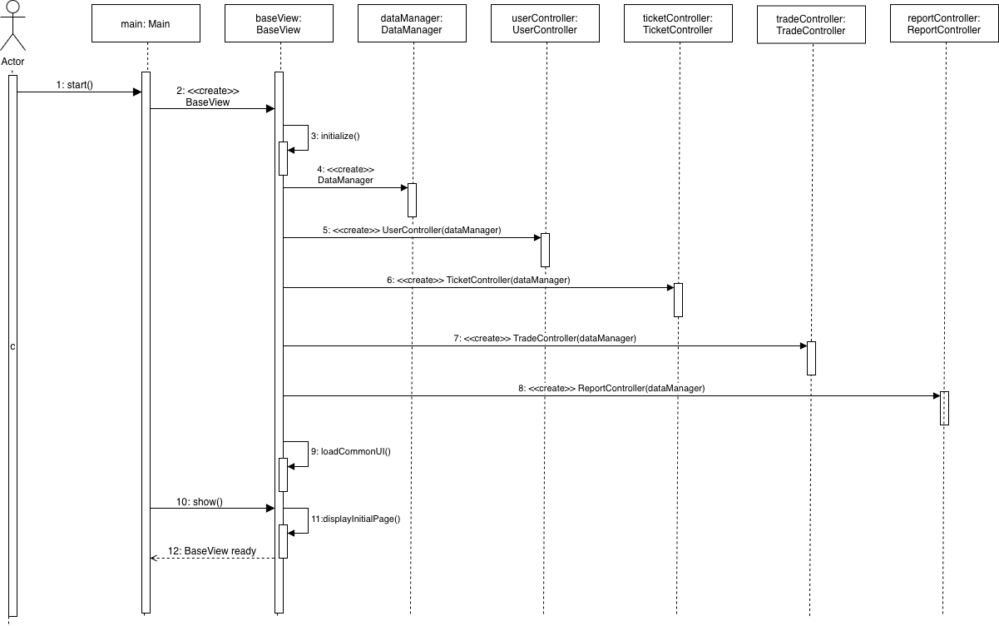

  Fig. 4. Init Path Sequence Diagram

Fig. 4는 Performance Ticket Trading System의 Init Path 시퀀스 다이어그램이다. 이 다이어그램은 사용자가 시스템을 실행했을 때 기본 화면과 주요 객체들이 초기화되는 과정을 나타낸다.

사용자가 시스템을 시작하면 `main: Main` 객체의 `start()` 메서드가 호출된다. `Main`은 시스템의 기본 화면을 구성하기 위해 `baseView: BaseView` 객체를 생성한다. 생성된 `BaseView`는 `initialize()`를 실행하여 초기화 작업을 수행하고, 시스템 데이터를 관리하기 위한 `dataManager: DataManager` 객체를 생성한다.

이후 `BaseView`는 사용자, 티켓, 거래, 신고 기능을 처리하기 위해 `UserController`, `TicketController`, `TradeController`, `ReportController`를 생성한다. 각 Controller는 생성될 때 `DataManager`를 전달받으며, 이를 통해 필요한 데이터를 조회하거나 수정할 수 있다.

Controller 생성이 완료되면 `BaseView`는 `loadCommonUI()`를 통해 공통 UI 요소를 불러온다. 이후 `Main`이 `show()` 메서드를 호출하면 `BaseView`는 `displayInitialPage()`를 실행하여 초기 화면을 표시한다. 마지막으로 초기 화면 구성이 완료되면 `BaseView ready` 메시지를 반환한다.

이를 통해 시스템은 사용자가 실제 기능을 수행하기 전에 기본 View, 데이터 관리 객체, 주요 Controller를 준비한다.

## 3.2 Sign Up

  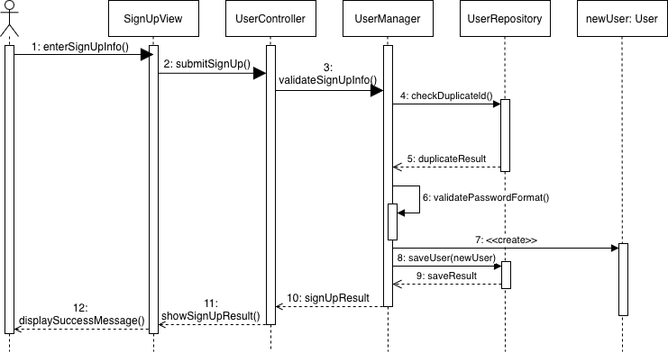

  Fig. 5. Sign Up Sequence Diagram

Fig. 5는 사용자가 회원가입을 수행하는 과정을 나타낸 시퀀스 다이어그램이다. 사용자는 SignUpView를 통해 회원가입에 필요한 정보를 입력한다. 입력된 정보는 SignUpView에서 UserController로 전달되며, UserController는 회원가입 요청을 처리하기 위해 UserManager에게 입력값 검증을 요청한다.

UserManager는 먼저 회원가입 정보가 올바른 형식인지 확인하고, UserRepository에 동일한 아이디가 이미 존재하는지 검사한다. UserRepository는 아이디 중복 여부를 확인한 뒤 그 결과를 UserManager에게 반환한다. 이후 UserManager는 비밀번호 형식과 같은 추가 조건을 검증한다.

모든 검증이 정상적으로 완료되면 UserManager는 새로운 User 객체를 생성한다. 생성된 사용자 정보는 UserRepository에 저장되며, 저장 결과는 다시 UserManager로 반환된다. UserManager는 회원가입 처리 결과를 UserController에게 전달하고, UserController는 SignUpView에 결과 화면 출력을 요청한다. 마지막으로 SignUpView는 사용자에게 회원가입 성공 메시지를 표시한다.

이 과정에서 입력값이 누락되었거나, 이미 사용 중인 아이디가 입력되었거나, 비밀번호 형식이 올바르지 않은 경우에는 회원가입이 완료되지 않는다. 이러한 경우 시스템은 사용자에게 오류 메시지를 보여주어 잘못된 계정 정보가 저장되는 것을 방지한다.

## 3.3 Login

  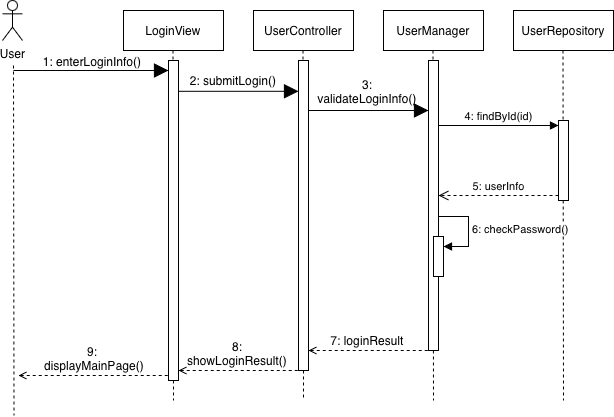

  Fig. 6. Login Sequence Diagram

Fig. 6은 사용자가 시스템에 로그인하는 과정을 나타낸 시퀀스 다이어그램이다. 사용자는 LoginView를 통해 아이디와 비밀번호를 입력하고, LoginView는 입력된 로그인 정보를 UserController로 전달한다. UserController는 로그인 요청을 처리하기 위해 UserManager에게 입력값 검증을 요청한다.

UserManager는 입력된 아이디를 기준으로 UserRepository에 저장된 사용자 정보를 조회한다. UserRepository는 해당 아이디와 일치하는 사용자 정보가 있는지 확인한 뒤, 조회 결과를 UserManager에게 반환한다. 이후 UserManager는 반환된 사용자 정보와 사용자가 입력한 비밀번호를 비교하여 로그인 가능 여부를 판단한다.

로그인 검증이 완료되면 UserManager는 로그인 결과를 UserController에게 전달한다. UserController는 이 결과를 LoginView로 반환하고, LoginView는 로그인 성공 시 사용자에게 메인 페이지를 표시한다. 반대로 아이디 또는 비밀번호가 입력되지 않았거나, 저장된 사용자 정보와 일치하지 않는 경우에는 로그인 처리가 중단되고 오류 메시지가 표시된다.

이 시퀀스 다이어그램은 로그인 기능에서 View, Controller, Manager, Repository가 각각 어떤 역할을 수행하는지 보여준다. LoginView는 사용자 입력과 결과 출력을 담당하고, UserController는 화면과 비즈니스 로직 사이의 요청 전달을 담당한다. UserManager는 로그인 검증 로직을 수행하며, UserRepository는 저장된 사용자 정보를 조회하는 역할을 한다.

## 3.4 Register Ticket

  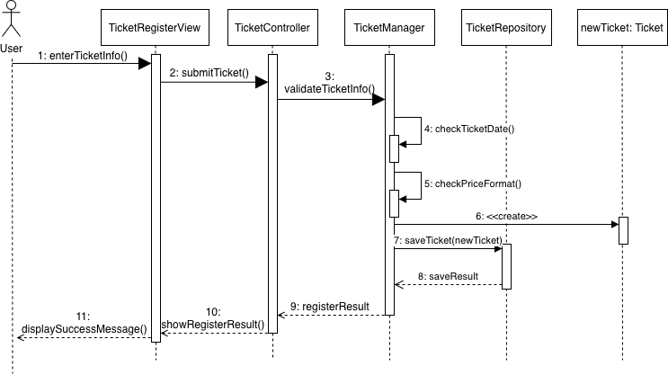

  Fig. 7. Register Ticket Sequence Diagram

Fig. 7은 사용자가 거래할 티켓을 등록하는 과정을 나타낸 시퀀스 다이어그램이다. 사용자는 TicketRegisterView를 통해 공연명, 공연 날짜, 좌석 정보, 가격, 설명과 같은 티켓 정보를 입력한다. TicketRegisterView는 입력된 티켓 정보를 TicketController로 전달하고, TicketController는 티켓 등록 처리를 위해 TicketManager에게 요청을 전달한다.

TicketManager는 입력된 티켓 정보가 올바른지 검증한다. 이 과정에서 공연 날짜가 과거 날짜인지 확인하고, 가격 형식이 올바른지 검사한다. 모든 검증이 정상적으로 완료되면 TicketManager는 새로운 Ticket 객체를 생성한다.

생성된 Ticket 객체는 TicketRepository에 저장된다. 저장 결과는 TicketManager와 TicketController를 거쳐 TicketRegisterView로 전달된다. 마지막으로 TicketRegisterView는 사용자에게 티켓 등록 성공 메시지를 표시한다. 만약 필수 티켓 정보가 누락되었거나, 공연 날짜가 올바르지 않거나, 가격 형식이 잘못된 경우에는 티켓 등록이 완료되지 않고 오류 메시지가 표시된다.

## 3.5 Search Ticket

  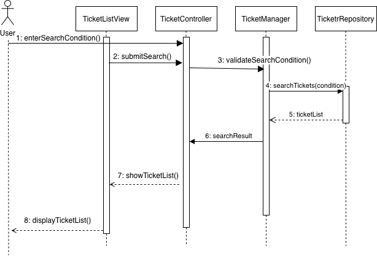

  Fig. 8. Search Ticket Sequence Diagram

Fig. 8은 사용자가 등록된 티켓을 검색하는 과정을 나타낸 시퀀스 다이어그램이다. 사용자는 TicketListView를 통해 검색어 또는 필터 조건을 입력한다. TicketListView는 입력된 검색 조건을 TicketController로 전달하고, TicketController는 검색 처리를 위해 TicketManager에게 요청을 전달한다.

TicketManager는 입력된 검색 조건이 올바른지 검증한다. 검색 조건 검증이 완료되면 TicketManager는 TicketRepository에 조건에 맞는 티켓 목록 조회를 요청한다. TicketRepository는 저장된 티켓 데이터 중 검색 조건과 일치하는 티켓 목록을 찾고, 조회된 ticketList를 TicketManager에게 반환한다.

검색 결과는 TicketManager에서 TicketController로 전달되고, TicketController는 TicketListView에 검색 결과 표시를 요청한다. 마지막으로 TicketListView는 사용자에게 검색된 티켓 목록을 화면에 출력한다. 검색 조건이 입력되지 않은 경우에는 전체 티켓 목록을 조회할 수 있으며, 조건에 맞는 티켓이 없는 경우에는 검색 결과가 없다는 메시지를 표시한다. 또한 날짜나 가격 필터의 형식이 올바르지 않은 경우에는 검색 처리가 중단되고 오류 메시지가 표시된다.

## 3.6 View Ticket Detail

  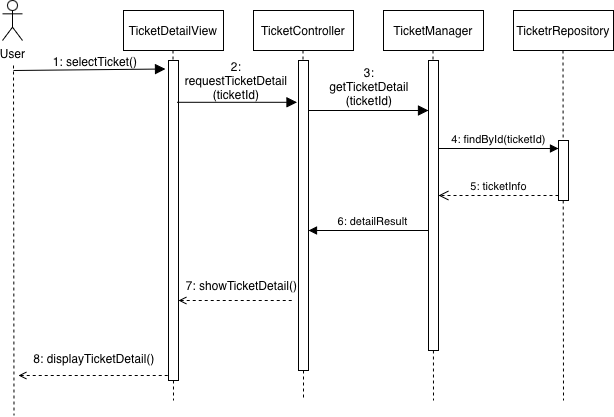

  Fig. 9. View Ticket Detail Sequence Diagram

Fig. 9는 사용자가 선택한 티켓의 상세 정보를 조회하는 과정을 나타낸 시퀀스 다이어그램이다. 사용자는 TicketDetailView에서 특정 티켓을 선택하고, TicketDetailView는 선택된 티켓의 ticketId를 TicketController로 전달한다. TicketController는 티켓 상세 조회 처리를 위해 TicketManager에게 요청을 전달한다.

TicketManager는 전달받은 ticketId를 기준으로 TicketRepository에 티켓 정보 조회를 요청한다. TicketRepository는 저장된 티켓 데이터 중 해당 ticketId와 일치하는 티켓 정보를 찾고, 조회된 ticketInfo를 TicketManager에게 반환한다.

조회 결과는 TicketManager에서 TicketController로 전달되고, TicketController는 TicketDetailView에 상세 정보 표시를 요청한다. 마지막으로 TicketDetailView는 사용자에게 공연명, 공연 날짜, 좌석 정보, 가격, 설명, 거래 상태와 같은 티켓 상세 정보를 화면에 출력한다. 만약 ticketId가 올바르지 않거나 해당 티켓이 존재하지 않는 경우에는 상세 정보가 표시되지 않고 오류 메시지가 출력된다.

## 3.7 Request Trade

  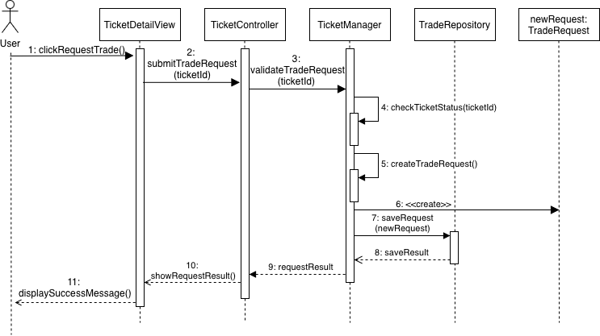

  Fig. 10. Request Trade Sequence Diagram

Fig. 10은 사용자가 특정 티켓에 대해 거래를 요청하는 과정을 나타낸 시퀀스 다이어그램이다. 사용자는 TicketDetailView에서 거래 요청 버튼을 선택한다. TicketDetailView는 선택된 티켓의 ticketId를 포함한 거래 요청 정보를 TradeController로 전달하고, TradeController는 거래 요청 처리를 위해 TradeManager에게 요청을 전달한다.

TradeManager는 전달받은 거래 요청 정보가 올바른지 검증한다. 이 과정에서 해당 티켓이 거래 가능한 상태인지 확인하고, 거래 요청을 생성할 수 있는 조건을 검사한다. 검증이 완료되면 TradeManager는 새로운 TradeRequest 객체를 생성한다.

생성된 TradeRequest 객체는 TradeRepository에 저장된다. 저장 결과는 TradeRepository에서 TradeManager로 반환되고, TradeManager는 거래 요청 처리 결과를 TradeController에게 전달한다. 이후 TradeController는 TicketDetailView에 결과 표시를 요청하며, TicketDetailView는 사용자에게 거래 요청 성공 메시지를 표시한다.

만약 해당 티켓이 이미 거래 완료 상태이거나, 사용자가 자신의 티켓에 거래를 요청하는 경우에는 거래 요청이 생성되지 않는다. 이 경우 시스템은 오류 메시지를 표시하여 잘못된 거래 요청이 저장되는 것을 방지한다.

## 3.8 Accept Trade

  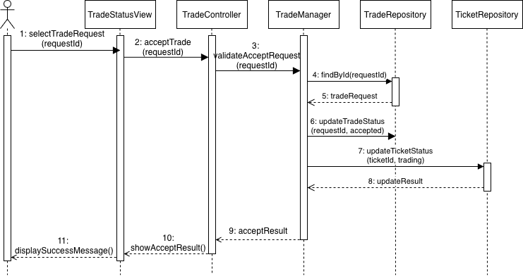

  Fig. 11. Accept Trade Sequence Diagram

Fig. 11은 사용자가 들어온 거래 요청을 수락하는 과정을 나타낸 시퀀스 다이어그램이다. 사용자는 TradeStatusView에서 수락할 거래 요청을 선택한다. TradeStatusView는 선택된 거래 요청의 requestId를 TradeController로 전달하고, TradeController는 거래 수락 처리를 위해 TradeManager에게 요청을 전달한다.

TradeManager는 전달받은 requestId를 바탕으로 거래 요청이 수락 가능한 상태인지 검증한다. 이후 TradeRepository에 해당 requestId와 일치하는 거래 요청 정보를 조회하고, TradeRepository는 조회된 tradeRequest를 TradeManager에게 반환한다. 거래 요청 정보가 확인되면 TradeManager는 해당 거래 요청의 상태를 accepted 상태로 변경한다.

거래 요청 상태가 정상적으로 변경되면, TradeManager는 TicketRepository를 통해 관련 티켓의 상태도 함께 trading 상태로 업데이트한다. 이는 거래 요청이 수락된 이후 동일한 티켓에 대해 다른 사용자가 중복으로 거래를 요청하거나, 이미 수락된 티켓이 계속 거래 가능 상태로 보이는 문제를 방지하기 위한 과정이다.

티켓 상태 업데이트 결과는 TicketRepository에서 TradeManager로 반환되고, TradeManager는 최종 수락 결과를 TradeController에게 전달한다. 이후 TradeController는 TradeStatusView에 결과 표시를 요청하며, TradeStatusView는 사용자에게 거래 요청 수락 성공 메시지를 표시한다.

만약 선택된 거래 요청이 존재하지 않거나, 이미 처리된 요청이거나, 해당 티켓이 더 이상 거래 가능한 상태가 아닌 경우에는 거래 수락이 완료되지 않는다. 이 경우 시스템은 오류 메시지를 표시하여 잘못된 거래 상태 변경을 방지한다.

## 3.9 Report

  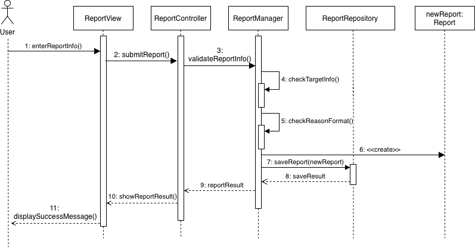

  Fig. 12. Report Sequence Diagram

Fig. 12는 사용자가 문제 있는 티켓, 거래, 또는 사용자를 신고하는 과정을 나타낸 시퀀스 다이어그램이다. 사용자는 ReportView를 통해 신고 대상과 신고 사유를 입력한다. ReportView는 입력된 신고 정보를 ReportController로 전달하고, ReportController는 신고 처리를 위해 ReportManager에게 요청을 전달한다.

ReportManager는 전달받은 신고 정보가 올바른지 검증한다. 이 과정에서 신고 대상 정보가 존재하는지 확인하고, 신고 사유가 올바른 형식으로 입력되었는지 검사한다. 모든 검증이 정상적으로 완료되면 ReportManager는 새로운 Report 객체를 생성한다.

생성된 Report 객체는 ReportRepository에 저장된다. 저장이 완료되면 ReportRepository는 저장 결과를 ReportManager에게 반환하고, ReportManager는 신고 처리 결과를 ReportController에게 전달한다. 이후 ReportController는 ReportView에 결과 표시를 요청하며, ReportView는 사용자에게 신고 접수 성공 메시지를 표시한다.

만약 신고 대상 정보가 존재하지 않거나, 신고 사유가 누락되었거나, 신고 내용 형식이 올바르지 않은 경우에는 신고가 접수되지 않는다. 이 경우 시스템은 오류 메시지를 표시하여 잘못된 신고 정보가 저장되는 것을 방지한다.

---

# 4. State machine diagram

  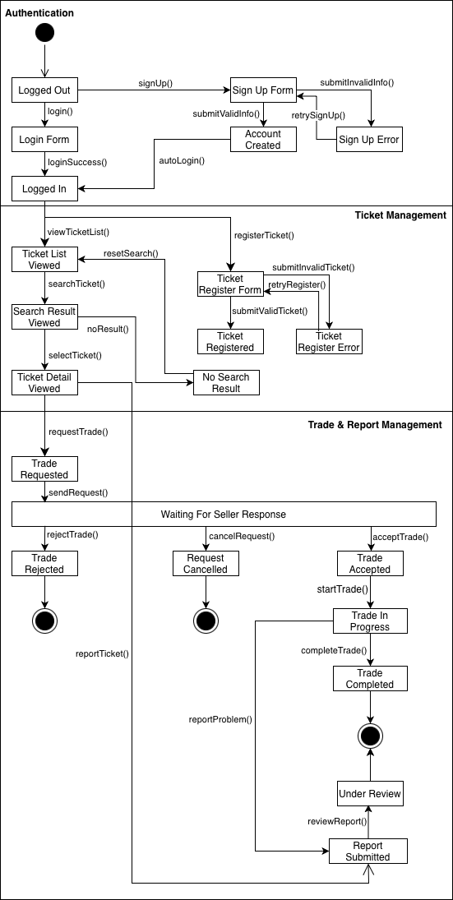

  Fig. 13. Ticket Trade State Machine Diagram

Fig. 13은 Performance Ticket Trading System의 State Machine Diagram이다. 이 다이어그램은 사용자가 시스템에 접속한 뒤 회원가입 또는 로그인을 수행하고, 티켓 조회 및 등록을 거쳐 거래 요청과 신고 처리로 이어지는 전체 상태 변화를 나타낸다. 시스템의 상태는 크게 Authentication, Ticket Management, Trade & Report Management 영역으로 구분된다.

Authentication 영역에서는 사용자가 로그아웃 상태에서 로그인 또는 회원가입을 수행한다. 로그인에 성공하면 Logged In 상태로 전환되고, 회원가입 정보가 유효하면 Account Created 상태를 거쳐 자동 로그인 상태로 이동한다. 반대로 잘못된 회원가입 정보가 입력되면 Sign Up Error 상태로 전환되며, 사용자는 다시 회원가입을 시도할 수 있다.

Ticket Management 영역에서는 로그인한 사용자가 티켓 목록을 조회하거나 새 티켓을 등록할 수 있다. 사용자는 검색을 통해 티켓 목록을 확인하고, 원하는 티켓을 선택하여 Ticket Detail Viewed 상태로 이동한다. 검색 결과가 없을 경우 No Search Result 상태를 거쳐 다시 티켓 목록으로 돌아갈 수 있다. 티켓 등록 과정에서는 유효한 정보가 입력되면 Ticket Registered 상태가 되고, 잘못된 정보가 입력되면 Ticket Register Error 상태에서 다시 등록을 시도할 수 있다.

Trade & Report Management 영역에서는 사용자가 티켓 상세 화면에서 거래 요청을 생성하고, 판매자의 응답을 기다린다. 판매자가 요청을 거절하면 Trade Rejected 상태에서 종료되고, 구매자가 요청을 취소하면 Request Cancelled 상태에서 종료된다. 판매자가 요청을 수락하면 거래는 Trade Accepted 상태를 거쳐 Trade In Progress 상태로 이동하며, 거래가 완료되면 Trade Completed 상태에서 최종 상태에 도달한다. 또한 티켓 상세 화면이나 거래 진행 중 문제가 발생하면 Report Submitted 상태로 전환되고, 이후 Under Review 상태에서 신고 내용이 검토된다.

---

# 5. Implementation requirements

본 챕터에서는 Performance Ticket Trading System을 구현하기 위한 운영 환경과 개발 환경 요구사항을 설명한다. 본 시스템은 웹 기반 티켓 거래 시스템으로 설계되었기 때문에 사용자는 일반적인 데스크톱 또는 노트북 환경에서 웹 브라우저를 통해 시스템에 접근할 수 있다.

| Type | Item | Requirement |
|---|---|---|
| H/W platform requirements | Processor | Intel or AMD dual-core or higher CPU |
|  | Memory | 4GB RAM |
|  | Storage | 1GB usable space |
| S/W platform requirements | OS | Windows 10 or higher / macOS / Linux |
|  | Browser | Chrome, Edge, Safari, or Firefox |
|  | Development Tool | Visual Studio Code |

---

# 6. Glossary

| Term | Description |
|---|---|
| User | 시스템을 이용하여 회원가입, 로그인, 티켓 등록, 티켓 검색, 거래 요청, 신고 등의 기능을 사용하는 일반 사용자이다. |
| Ticket | 공연명, 공연 날짜, 좌석 정보, 가격, 설명, 거래 상태 등의 정보를 포함하는 공연 티켓 데이터이다. |
| Login | 사용자가 아이디와 비밀번호를 입력하여 시스템 접근 권한을 확인받는 과정이다. |
| Sign Up | 사용자가 이름, 아이디, 비밀번호, 이메일 등의 정보를 입력하여 새로운 계정을 생성하는 과정이다. |
| View | 사용자가 시스템을 이용하기 위해 직접 마주하는 화면 또는 사용자 인터페이스이다. |
| Controller | View에서 전달된 사용자의 요청을 받아 적절한 기능 처리 객체로 전달하고, 처리 결과를 다시 View로 반환하는 클래스이다. |
| Manager | Controller에서 전달된 요청을 바탕으로 입력값 검증, 객체 생성, 상태 변경 등 주요 비즈니스 로직을 수행하는 클래스이다. |
| Repository | 사용자, 티켓, 거래 요청, 신고 정보와 같은 데이터를 저장하거나 조회하는 역할을 담당하는 클래스이다. |
| DataManager | 여러 Controller에서 필요한 데이터를 공통적으로 저장, 조회, 수정, 삭제할 수 있도록 관리하는 데이터 처리 클래스이다. |
| Trade | 사용자 간 티켓 거래 요청, 수락, 상태 확인, 거래 완료까지 이어지는 전체 거래 과정을 의미한다. |
| TradeRequest | 구매자가 특정 티켓에 대해 거래를 요청했을 때 생성되는 거래 요청 데이터이다. |
| Report | 허위 티켓, 부적절한 사용자, 문제 있는 거래 행위 등을 신고하기 위해 생성되는 신고 데이터이다. |
| Sequence Diagram | 시간의 흐름에 따라 사용자, View, Controller, Manager, Repository 사이의 메시지 전달 순서를 나타내는 다이어그램이다. |
| State Machine Diagram | 시스템 또는 객체가 가질 수 있는 상태와, 이벤트에 따라 상태가 어떻게 변화하는지를 나타내는 다이어그램이다. |

---

# 7. References

- None
